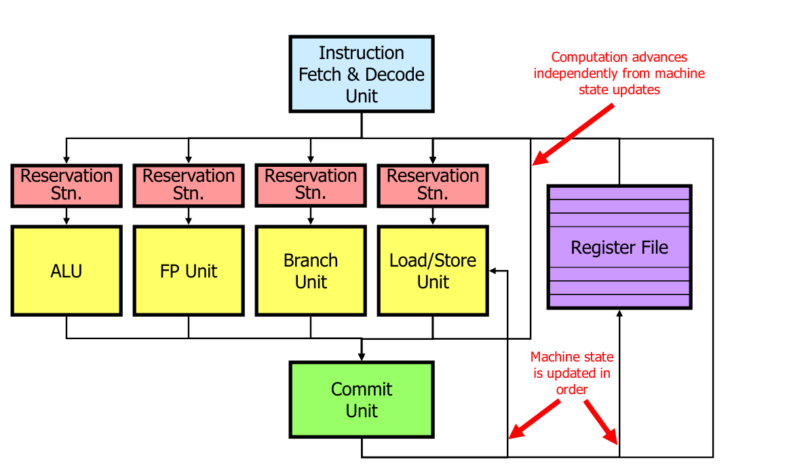
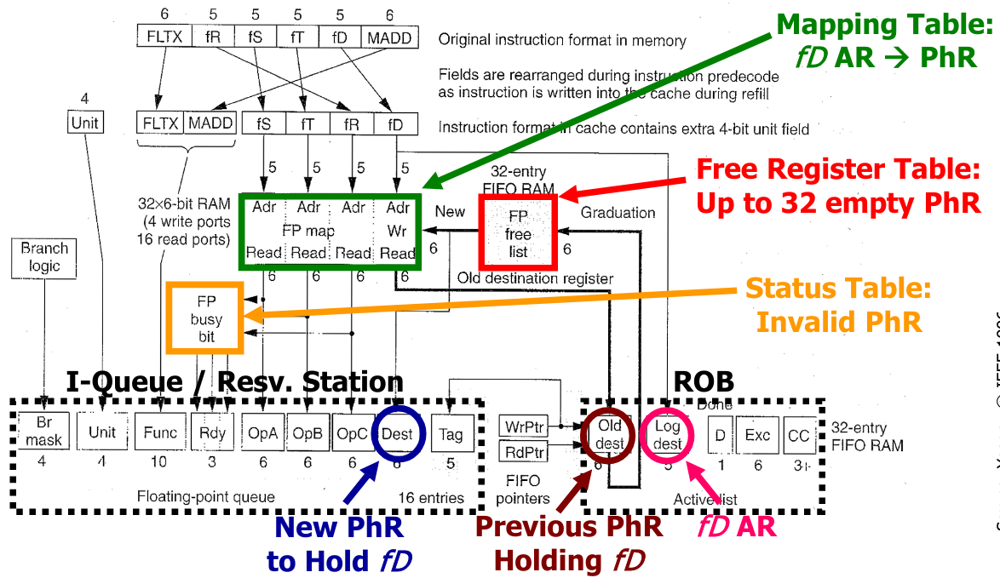

---

**Markdown** version on
[*github*](https://github.com/caillouc/Fiche_EPFL/blob/main/Advanced_computer_architecture/Advanced_computer_architecture.md?plain=1)  
Compiled using [*pandoc*](https://pandoc.org/) and [*`gpdf` script*](https://github.com/caillouc/dotfile/blob/linux/gpdf.sh)  

# General Purpose Architectures

## Exploiting ILP Dynamically

### Pipelining

* **ILP** : Instruction Level Parallelism
* **Pipelining** is a simple form of ILP : Several instructions are being
  executed at once
  * The *latency* is unmodified
  * The *throughput* is higher
  * Adding resgisters to cut combinatorial logic
  * Each new register add a bit of latency and increase de power consumption
  * **Dependencies** slow down the possibility of pipelining
    * To detect dependencies we can simply have a look to the destination
      registers of intermediaire registers and verify that they are not needed
      by the instructions that have been fetch
    * Either add logic to detect dependencies (hardware) and stall the pipeline
      or requires the right number of nop between instructions to avoid issues
      (compiler)
  * Several instructions are run in parallel
  * **Control hazards** limit the usability of the pipeline
    * Must squash fetched and decoded instruction following a branch
  * **Data hazards** limit the usability of the pipeline
    * Whenever the next instruction cannot be executed, the pipeline is stalled
      and no new useful work is done until the problem is solved
    * Can be solved by forwarding newer values (bypass the register file)
  * **Rigid sequencing**
    * Special "slots" for everything even if sometimes useless (e.g. MEM before
      WB)
    * Every instruction must be coerced to the same framework
    * Structural hazards avoided "by construction"
* **Dynamic Scheduling** : solve dependencies in hardware

### Dynamic Scheduling

* While waiting for a dependency to be resolved, schedule other instruction
  * Instructions can be executed out of program order (but the result must still
    be correct)
* Dynamic scheduling allow **Binary compatibility**, the same code will work for
  different processors, Parallelism is handle in hardware on not by the compiler
* **Structural hazars**
  * Are the required resources available
  * Previously handled by rigid pipeline
* **Data hazards**
  * RAW : Are the operands ready to start execution
  * WAR and WAW : The new data overwrite something which is still required
* **RAW** : Read after write
* **WAR** : Write after read
* **WAW** : Write after write
* Dynamic pipelines may create WAW hazards
* Register after the decode state is bigger since it must be abble to store
  several instructions. A **reservation station** checks that the operands are
  available (RAW) and that the execution Unit is free (Structural Hazard), then
  starts execution
  * Unavailable operands are identified by the name of the reservation station
    in charge of thr originating instruction
  * *Tag* keeps track of which instruction will generate the result I am waiting
    for. Tag here are the name of an entry of the reservation station
    * *Tag* cannot be register name since they are not unique
    * *Tag* cannot be the PC (even tough it looks) since we can have a branch in
      a loop for example
  * Can find dependencies using the reoder buffer (see later)
    * Reorder buffer keeps track of all instructions that have not been commited
      yet
    * Reorder buffer can be used to bypass the register file
* **Implicit register renaming** removes WAR and WAW hazards
* New results are seen at their inputs through special results bus(es)
* Writeback into the registers can be done in order or out of order
* **Architectural states** are known by the programer
* **Microarchitectural states** are know not by the programer, only used by the
  processor
* Exception handler should now exactly where a problem has occured, especially
  for **non terminating exceptions** (e.g., page fault) so that they handle the
  event and resume exactly where the exception occured
  * *Precise exceptions* : Reordering at commit; user view is that of a fully
    in-order processor
  * *Imprecise exceptions* : No reordering; out-of-order completion visible to
    the user
* A processor can do *whatever it wants* provided that it gives the *appearance
  of sequential execution*
* **Reorder buffer** (ROB) : redorders instructions in the commit unit
  * Pointer to the head and to the tail
  * Every time I decode an instruction, I add it to the Reorder buffer with the
    corresponding *tag* and the destination register
  * During execution *tag* are replaced by actual values/results; more precisly
    the only instruction with the given *tag* will be updated
  * When the head pointer is ready (results has been computed) we can commit;
    Otherwise we wait and do not commit any instructions
  * PC is also stored in the Reoder buffer to remember where was an eventual
    exception. This way wen can rejump to this instruction once the exception
    have been handled (or not, for terminating excepetion)
  * There is an address destination slot as well as a register destination slot.
    Either the register or the address slot is used, because the results has to
    be written either to memory or to a register
* Informations/results bypass the register file in order to be reuse faster,
  however in register file results are in order
* When a synchronus exception happens, we do not report it but we **mark the
  entry** corresponding to the instruction which caused the exception in the ROB
  * When we would be ready to **commit** the instruction, we **raise the
    exception** instead
  * We also **squash** the content of the ROB and of all RSs
* The way to detect and resolve dependencies through memory is the same as for
  registers; For every load, check the ROB
  * If there is **no store to the same address** in the ROB, get the value from
    memory
  * If ther is a **store to the same address** in the ROB either get the value
    (if ready) or the tag
  * If there is a store to an **unknown address** in the ROB or if the address
    of the load in unknown, **wait**
* Additional memory dependencies can be solved via a **Load Queue** and a
  **Store Queue** (mimic the ROB). They would replace the memory reservation
  station
  * Load queue entries have a pointer to an entry in the store queue to know
    every store that where before the load
* Last improvment is Superscalar, having several fetch and decode unit as well
  as several alu and memory unit

### Renaming registers

* **Register renaming** is used to get rid of WAR and WAW
* **Location for rename registers**
  * Merged rename and architectural RF
  * Slpit rename and architectural RFs
  * Renamed values in the reorder buffer
  * Renamed values in the reservation stations (a.k.a. shelving buffers)
* Tracking the mapping table: Where  is Physically an Architectural Register
  * Mapping in a **Mapping table**
  * Renaming in the **Rename buffer**
* **State Transition in a Merged file + Information flow**
  * Initialization : First $N$ registerss are 'AR', others are 'Available'
  * *Available* $\rightarrow$ *Renamed Invalid* : Instruction enter the
    Reservations Stations and/or the ROB: register allocated for the result
    (i.e., register uninitialised)
    * Read new PhR from top of Free Register Table
    * Create new mapping *LogDest* $\rightarrow$ *Dst* in the mapping table
    * Set corresponding *Busy-Bit* (=invalid) in the Status Table
  * *Renamed Invalid* $\rightarrow$ *Renamed Valid* : Instruction completes
    (i.e., register initialised)
    * Write PhR *Dest* indicatied in the I-Queue
    * Reset corresponding *Busy-bit* (=valid) in the Status Table
    * Mark as *Done* in the corresponding entry in the ROB
  * *Renamed Valid* $\rightarrow$ *Architectural Register* : Instruction commits
    (i.e., register "exists")
    * Implicit (removal of historical mapping *LogDest* $\rightarrow$ *Dest*)
  * *Architectural Register* $\rightarrow$ *Available* : Another instruction
    commit to the same AR (i.e., register is dead)
    * Free PhR indicated by *OldDest* in the entry removed for the ROB
  * *Renamed Invalid* and *Renamed Valid* $\rightarrow$ *Available* : Squashing
    * Restore mapping from all squashed ROB entries (from tail to head) as
      *LogDest* $\rightarrow$ *Dest*
    * Reset corresponding *Busy-Bit* (=valid) in the Status Table
* **State Transition Replaced by Copying in Stand-aloone RFF**
  * Initialization : All Rename registers are "Available"
  * *Available* $\rightarrow$ *Renamed Invalid* : Instruction enter the
    Reservation Stations and/or the ROB: register allocated for the results
    (i.e., register uninitialised)
  * *Renamed Invalid* $\rightarrow$ *Renamed Valid* : Instruction completes
    (i.e., register initialised)
  * *Renamed Valid* $\rightarrow$ *Available* : Instruction commits (i.e.,
    register "exists") $\Rightarrow$ Value is copied in the Architectural RF
  * *Renamed Invalid* and *Renamed Valid* $\rightarrow$ *Available* : Squashing
    (no copy to the Architectural RF)
  

### Predictions and Speculation

* How do I make a good guess ?
  * Either one outcome is typical and far more frequent : *Static prediction*
  * Or I need to remember some history : *Dynamic prediction*
* What do I do if the guess was wrong ?
  * Undo speculatively ececuted instructions ("squash")
    * May or may not cost something
* **Exceptions**
  * **Prediction** For every instruction, we have guessed that there will be no
    exception (static prediction)
  * **Speculation** In case of exception we have used the ROB to squash all
    instructions after the faulty one raising exception
* General Idea (our ROB does just that) :
  * After a prediction, hold every potential change in state of the processor
    (e.g., register values, memory writes) in a buffer
  * If the prediction turn out to be correct, let the content of the buffer
    affect the state (= commit)
  * Tf the prediction rusn out to be wrong, simply trash the content of the
    buffer
* **Branch Preciction**
  * *Static* : Maybe we can assume that every backward branch is part of a loop
    and thus usually taken
  * *Dynamic* Maybe we can observe what happens during execution and learn
* **Branch Speculation**
  * In a simple pipeline we may simply fetch and decode instructions
    $\rightarrow$ easy, no state changes
  * In a complex out-of-order superscalar we may really execute instructions
    speculatively $\rightarrow$ ROB
  * Predicted branches are inserted in the ROB with predicted target
    * A predicted branch whose outcome is unknown cannot be commited
    * If $outcome = address$ then we can commit (= correct prediction) (in
      reality we do not commit the instruction, it is simply moving the head)
    * If $outcome \neq address$ then we do not commit and squash everything
* **Branch target Buffer** : Map between Branch Addresses (PC of the branch) and
  Target Addresses (fully associative)
  * To make this cheaper we can split the PC in an index entry (7 last bits for
    example) and a TAG (other bits). An entry could contains several TAGs.
* **Branch history table** : Part of the branch PC correspond to the index of
  the table and one bit prediction is stored at this location. However this
  table does not store the address of the branch. This allow collision but is
  cheaper. The prediction can also be over two bits.
  * One bit predictor : do the same as last time
  * Two bit predictor (saturing counter) : adding some "inertia" or "take some
    time to change your mind"
  * Modified two bit saturating counter : Two mispredictions $\rightarrow$ stong
    reversal (instead of weak for default two bit predictor)
* **Exploit correlation** : *(m, n) Branch Predictor Buffer* A global m-bit
  predictor uses the outcome of the last four different predictors
* **gshare** : replace concatenation with a better hash function
* **Return address stack** stores return address in the processor and use them
  for jump predictor without having to deal with the stack
  * Mispreduction has high cost
* **Memory dependencies**
  * **Prediction**
    * We can optimistically assumen that ther is *no dependence* (it is the only
      asssumption that makes us gain time and the opposite assumption never
      leads to a functional mistake ...)
    * One could certainly do better than simply assuming that any potential RAW
      through memory is not a RAW (= simple **static dependence prediction**)
    * The goal is to reduce the probability of squashing and replaying (if
      squashing costed nothing, the prediction would be ok, but squashing almost
      invariably has a cost - and definitively in terms of energy)
    * Essentially one could build **dynamical predictprs** similar in spririt to
      branch predictors (the intuition is that dependences are program specific
      but often **stable** during program execution) $\rightarrow$ learn from
      history and remember what happens on previous visits of a load
    * In fact, one could even predict a specific dependence (**alias
      prediction**-that is, in which strore a given load depends) and use it to
      bypass memory before addresses are known
  * **Speculation**
    * If there was a dependence every data dependent instruction should be
      squashed; independent instructions were actually correctly executed
    * If we accept to squash *all* following instructions, this situation is not
      qualitatively different from what we have seen for other cases
      $\rightarrow$ ROB
* Predicting the next miss
  * Fetch data into the cache ahead of processor demanding it
  * **Predition**
    * *What* and *when* to get from memory
    * As usual, exploit *typical behavior* (e.g., programs are sequences of
      instructions) and learn from (*execution history*)
  * **Speculation**
    * Since we are putting data in the cache (which is not architecturally
      visible), *nothing to do to rollback*
    * Still, prefetching has a *cost* (besides energy, it consumes memory
      bandwidth) and could be damaging (leads to eveciton os useful stuff)
* **Prefectching**
  * **Coverage** How many misses prefetching removes
  * **Accuracy** How many prefetched cache lines are useful over all
    prefetched lines
  * Sort of a trade-off :
    * prefetching very *agressively* improves coverage but reduces accuracy
      $\rightarrow$ pullutes the cache
    * prefetching *conservatively* may improve accuracy but reduces coverage
      $\rightarrow$ little benefit
  * Simple idea
    * If the cache line $X$ is a miss, load $X$ but also $X+1$
    * Do not load $X+1$ immediately but wait until the processor asks for an
      instructions some *fetch-ahead-distance* from the end of the line
    * Could also load $X+N$ instead. If $N$ is too small $\rightarrow$ poor
      coverage and if $N$ is too large $\rightarrow$ poor accuracy
  * **Stride prefetching**
    * On a request for $X$, prefetch $X+S$, $X+2S$, ...
    * Ussually takes a few misses to detect and build confidence in a constant
      stride
* **Stream buffer**
  * There may be various streams mixing
  * Aggressive prefetching of multiple streams lead ot cache pollution
  * Implements multiple Next-N-Line or Stream prefetchers
  * Place the prefetched lines in FIFO buffer instead of the cache
* Speculation is not necessarily a Run-Time Concept
  * Dynamic : in hardware, no interaction whatsoever from the compiler
    * Binary code in unmodified
  * Static : in software, planned beforehand by the compiler
    * Binary code is written in such a was as to do speculation (with or withour
      some harware support in the ISA)
* **Predicated (= guarded) execution**
  * A special form of static control speculation, "I cannot make a good
    prediction ? I will avoid gambling and will do both"
  * A bit more than that : removes control flow change altogether
  * Not always a good idea : compiler tradeoff
    * (Almost) free if one uses execution units which where not used otherwise
    * Not free at all in the general case : more than needed is always executed

+------------------+--------------------------------+------------------------------+
|                  | **Dynamic** (by the hardware)  | **Static** (by the compiler) |
+:================:+:===============================+:=============================+
| **Exceptions**   | * Out of order and reordering  |                              |
|                  | * Imprecise exceptions in DBT  |                              |
+------------------+--------------------------------+------------------------------+
|                  | * Branch prediction            | * Trace Scheduling           |
| **Control**      |                                | * Hyperblocks                |
|                  |                                | * Prediction                 |
|                  |                                | * Prediction                 |
+------------------+--------------------------------+------------------------------+
| **Data**         | * Virtual memory               |                              |
| **Availability** |                                |                              |
+------------------+--------------------------------+------------------------------+
| **Data**         | * Load/Store Queues            | * Advanced Loads             |
| **Dependence**   |                                |                              |
+------------------+--------------------------------+------------------------------+
| **Data**         |                                | * Dynamic compilers          |
| **Value**        |                                |                              |
+------------------+--------------------------------+------------------------------+

### Simultaneous multithreading

* Multithreading : pick other program instructions to fill empty slots
  * Fetch from mutltiple threads
* Processor must be aware of several independent states, one per each thread
  * Program counter
  * Register File
  * Memory
* Either mutltiple resources in the processor or a fast way to switch across
  states
* **Vertical waste** Complete idle cycle
* **Horizontal waste** Partially filled cycle
* **Cycle by Cycle interleaving multithreading** (or Fine-Grain multithreading)
  * Round robin selection between a set of threads
  * Requires several Pragram counter and register file
  * Would allow to remove some forwardind path (since two instructions does not
    belong to the same thread, they canot depends on each other)
  * The single thread latency is increase by a factor $N$
    * It is no acceptable that single thread performance goes significantly down
      or at all
  * Null time to switch context
    * Multiple Register Files
  * No need for forwarding paths if threads supported are more than pipeline
    depth
    * Simpler hardware
  * Fills wee short vertical waste (other threads hode latencies)
  * Fills much less will long vertical waste (the thread is rescheduled no
    matter what)
  * Does not reduced significantly horizontal waste (per thread, the instruction
    window is not much different)
  * **Significant deterioration** of single thread job
  * $\Rightarrow$ never really used
* **Block interleaving multithreading** (or Coarse-Grain multithreading)
  * Keep executing a thread until something happens
    * Long latency instructions found
    * Some indication of scheduling difficulties
    * Maximum number of cycles per thread executed
  * Scheduling of threads not self-evident
    * What happends of thread #2 if thread #1 executes perfectly will and leaves
      no gap
    * Explicit techniques require ISA modifications
  * More time allowable for context switch
  * Fills very well long waste (other threads come in)
  * Fills poorly shoirt vertical waste (if not sufficient to switch context)
  * Does not reduce almost at all horizontal waste
* **Simultaneous multithreading (SMT)**
  * *Prioritised scheduling*
    * Thread #0 schedules freely
    * Thread #1 is allowed to use #0 empty slots
    * Thread #2 is allowed to use #0 and #1 empty slots
    * etc.
  * *Fair Scheduling*
    * All threads complete for resources
    * If several threads want the same resource, round-robin assignment
  * Multiple program counters (= threads) and a policy for the instruction fetch
    units to decide which threads to fetch (*Fetch and decode stage*)
  * Multiple or larger register files with a least as many registers as logical
    registers for all threads (*Commit stage*)
  * Multiple instructions retirement (e.g., per thread squashing)
    * No change needed in the execution path
  * Thread aware branch prediction
  * Per thread Return Address Stacks
  * Need to add a thread field in the ROB, to commit to the register of the
    right thread
    * No need to add this field in the reservation stations
  * Very good performance
* **Where to fetch**
  * **Static** solutions : Round-Robin
  * **Dynamic** solution: Check execution queues
    * Favour threads with minimal number of in flight branches
    * Favour threads with minimal number of outstanding misses
    * *Favour threads with minimal number if in flight instruction*
    * Favour threads with instructions for from queue head
  * Does not matter to much

## Exploiting ILP Statically

### VLIW Architecures and Compilers

* **VLIW** Very Long Instruction Word
* Schedule is to decide WHEN and WHERE each instrction is executed
* Scheduling happens at run time in superscalars and it happens exclusively at
  compile time in VLIWs
* Run time scheduling in superscalars requires considerable resources in the
  processor hardware
  * Reservation stations and reorder buffer
  * Renaming registers and various sorts of mapping tables
* **Static scheduling** : What each unit does in each cycle is decided at
  compile time in software
* **Superscalar processor**
  * **Hardware** detects parallelism among instructions
  * Scheduling is first performed at compile time, but with very loose
    information on the architecture the program will be run on
  * Final scheduling is performed at **run time**
* **VLIW (or EPIC) Processor**
  * **Software** detects parallelism among instructions
  * Scheduling is performed at compile time
* In traditional processor (superscalar) $cycles \neq instructions$
  * Latency-independent semantics
* IN VLIW processor $cycles = instructions$
  * Latency-dependent semantics
* **Area Advantage** : no need for the harware use in superscalar for dynamic
  dependence analysis $\rightarrow$ More execution units
* **Timing Advantage** : no need for complex dependence analysis every cycle
  $\rightarrow$ Clock frequency can be higher
* Challenges of VLIW
  * **Compiler Technology**
    * Compiler now responsible for scheduling
    * Most severe limitation until recently
  * **Binary Incompatibility**
    * Consequence of the larger exposure of the microarchitecture (=
      implementation choices) in the architecture
  * **Code Bloating**
    * All those NOPs occupy memory space and thus cost
    * But there are also other reasons ...
* **Code Bloating problem**
  * Larger code is a serious problem
  * In a fisrt approximation, the problem is due to the explicit NOPs
  * Not just a DRAM cost issue (main memory is cheap) but has weird impacts on
    cache performance (size, cache pollution, associativity, etc.)
  * Code compression : Differentiate Fetch Packet and Execute Packet
  * Instrucions are encoded in a less straightforward way
    * Separator bit $= 0$ : next operation is in parallel
    * Separatpr bit $= 1$ : next operations is sequential
    * Unit number : specifies where to execute operation
  * Price to pay for shorter code
    * Fetch/Decode logic more complex
    * Crossbar for shipping operations to the rights FU, complexity proportional
      to $n^2$
  * Hardware was supposed to be trivial and $\mathcal{O}(n)$ ...
  * A trivial but significant reason for bloating is removed
  * More fundamental and difficult to overcome reasons exist which still
    increase significantly the code size
* **The binary compatibility problem**
  * More information is now visible in the code
    * **Instruction latencies** used to enforece correct handling of data
      dependencies
    * **Available hardware parallelism** units scheduled on each cycle
  * More subtle sources of incompatibility
    * change in instructions latencies
  * No fully satisfactory solution exists today
  * Partial or resaerch solutions
    * Recompile
    * Special VLIW coding/restrictions
    * Dynamic binary Translation is emerging
* Latency cannot increase
  * Trivially, higher latendcy may violate data dependencies
* **Compiler Technology problem**
  * Parallel exectution is limited byt the need to find independent instructions
  * We need to deal with both data and control dependencies
* **Control dependencies**
  * If
    * We have abundant resources (machine parallelism) and  
    * We do not care about power dissipation, etc. bu just look for performance
  * We can execute all paths in parallel without making a choice
  * Instructions can be executed in parallel, but they are commited only if the
    relative predicate is true
  * **Predicate Execution** needs architectural support, we need :
    * An instruction to set the predicate
    * Predicate registers
    * An additional field in the instruction word
    * A way to check and delay exceptions
    * **Full**: all instructions can be executed conditionally
    * **Partial**: typically a single conditional instruction
  * **Loop tranformations**
    * Loops are often the most important part of the code (in terms of fraction
      of total code)
    * Loops bodies can ce transformed so that more parallelism can be exloited
    * **Loop peeling** remove some iterations of the loops and add them after
      (change the total number of iterations)
    * **Loop fusion** : merge two loops in one (might need loop peeling)
    * **Loop unrolling** : Creating larger loop bodies $\rightarrow$ bigger
      basic block leeds to more chance for parallelism
* VLIW code fundamentally larger than standard code: not only NOPs are explicit,
  but aggressive unrolling multiples real instructions
* **Software pipelining**, goal : restructured the loop, so that ILP can be
  exploited
  * Prologue, Body and Epilogue  
  * **Iterations** advancing in parallel
* Dependences : Trace Scheduling 
  * Optimise the **most probable path** by increasing the size of basic blocks
  * Add compensation code in less probable paths
* **Compile time speculation**
  * **Register renaming** to ensure that correction code source operands are
    preserved
  * Because of **exceptions**, you only need to either: 
    * **Avoid errors** : Speculate only instructions which cannot raise
      exceptions (but one wants to speculates loads)
    * **Resolve errors** : Add a special field in the opcode (Poison bit, ...)
      that says when an instructions has been speculated
* Elimination WAW and WAR at compile time
  * Rename: Eliminate dependencies by using more registers at compile time
    * Need more architecturally visible registers 
* RAW is the only important one : moving a load above a store
  * At runtime we have more information on memory addresses 
  * But a **compile time** we have **more time available**: we can make much
    more complex analysis which depend on a wider knowledge og the code 
* Conclusion on VLIW compilers
  * Many different decisions 
    * Which type of region is right? Trace, superblocks, hyperblocks,
      treeregions
    * Which regions to optimise
    * To unroll or not to runroll? How many times? 
    * To predicate or not to predicate? 
    * When to allocate resgisters
    * $\rightarrow$ powerful compiler backends for VLIWs are **very hard** to build

## Dynamic Binary Translation

* Single worst obstacle to processor evolution
* Translate/Optimize a binary file (*Source architecture*) to physical hardware
  (*Target architecture*)
* **Emulation** : terrible in term of performance
* **Static translation** : change the binary to fit the target architecture,
  should have good performance
  * **Code identification** : all code must be discovered statically and
    separated from embedded data
  * **Self modifying code** : what to do with it? Additional hardware to allow
    support of source architecture? 
  * **Precise Exceptios** : no 1-to-1 relation between target instructions and
    source ones
  * **OS** : support of shared librairies and system calls
* **Dynamic Binary Translation** : merge emulation and translation to get the
  best of both worlds, see image below
* **Optimization to Translated Code**: ILP Scheduling, Loop unrolling, Alias
  analysis, Load store telescoping, Copy propagation, Combining, Unification,
  Limited dead code elimination
  * These optimizations are now simpler since we saw the code behaviour several
    time 
* Now inside the porcessor we have a DBT (Dynamic Binary Translation) engine,
  located between the OS and the VLIW Processor
* **Difficult Problems for DBT**
  * **Code discovery** : Not a problem anymore, wince we are in the middle of the
    emulator
  * **Self modifying code** : injected code is not translated thus would lead to
    issues
    * If we detect the injected code, we can simply jump back to the emulator
      part (in blue in the image)
    * Use the TLB to detect when one writes to the code and thus detect *sefl
      modifyng code*
  * **Asynchronous exception**
    * Can be delayed, no big deal
    * Wait until end of group
    * Translate exception handler
    * Invoke translated exception handler
  * **Synchronous exceptions**
    * During emulation, no issue
    * If synchronous exception during the execution of a translated and
      optimized group of VLIW instructions, unclear instructions and state
      w.r.t. source architecture
    * Revert status to begenning of current translated group (needs some
      architectural support : Set of *shadow registers* (which get the value of
      the main registers at at the end of a group) and gated *store buffer*
      (which holds pending stores for commit at the end of a group)
    * Re-emulate source architecture to find the exact point of the execution
      and to leave the processor in the architecturally correct state
    * Invoke translated exception handler 
* Additional Optimization in BDT
  * **Block Reordering**: Make target image execution as sequential as possible
  * **Memory Colouring**: Improve mapping of translated code to fit target
    memory hierarchy
  * **Code Specialization**: Clone procedures based on constant parameter values 
* **Benefits** of DBT
  * Compatibility
    * With native implementation
    * Across different VLIWs sizes and generations
  * Reliability and possibilities to upgrade
    * Software patches for bugs in translator
    * Software patches for optimizer enhancements
    * Translator can be used to hide hardware bugs
  * Low hardware cost
    * SW scheduler: smaller chip with higher yield
    * Fast in-order implementation
  * Higher instruction-level parallelism
    * Dynamic groups can be made arbitrary large
  * Low-power consumption
    * Memory consumes less than logic: Schedule once and then fetch from memory
      (?)
* **Issues** of DBT
  * Reduced resources from the user 
    * Cycles: lost performance for translation
    * Memory
  * Slow at start (emulation) and real times difficulties
  * Debugging difficulties
    * Target machine code far removed from source code
    * Non-deterministic behavious or real systems
* Static optimization in compiler backend is limited
  * Tranlate with the same source and target architecture : **dynamic
    optimisations**
    * Identify long instruction groups (*traces*)
    * Extends traces over
    * Optimize traces: classic ILP optimizations remove unconditional branches,
      ...
  

# Application-Specific Computing

## Instruction Set Extensions and High-Level Synthesis

* Increasing the efficiency of implementations (from C programs to more
  efficient programmable solution)

### Automatic Processor Customization - Instruction Set Extensions

* Collapse a subset of the Direct Acyclic Graph node into a single Functional
  Unit (AFU)
  * Exploit cheaply the parallelism within the basic block
  * Simplify operations with constant operands 
  * Optimize sequences of instructions
  * Exploit limited precision
* Using hardware for special functional unit
* Why hardware is better ?
  * Spatial computation
    * Cheap ILP without true ILP support
  * No quantization of time in clock for each operation/instruction
    * Operation chaining
  * Hardware is a different 
    * Constant may be propagated
    * Precision can be tuned (bitwidth analysis)
    * Arithmetic components can be optimized
    * Arithmetic operations often appeat in groups 
    * A literal/sequential implementation may not make the best of the potential
      available
    * A different number representation can be game-changer
* **Automatic ISE Discovery**
  * Formulate it a an optimization problem
  * "Give me your application in C, let me zoom in and let me try to find the
    biggest part that I can take so that I convert this into hardware, I put
    them as a functional unit of my processor and whenever you give me that
    program, instead of going and resortign to the normal functional unit, I do
    it on this special functional unit"
  * Find subgraph
    * having a user-defined maximum number of inputs
    * convex
    * possibility including disconnected components and
    * that maximise the overall speedup
* **Processor customisation**
  * Arguably the **most widespread method of designing embedded hardware**:
    selection one of very many existing processor or configuring the parameters
    of a family of precessors amounts to customization for a set of applications
  * **Little automation**, thought: still moslty a manual design-space
    exploration; glimpses of automation in the 2000s seem lot
  * Autimatic ISE discovery could be a more promising automatic custimization
    opportunity, but also disapeared in the late 2000s
    * Pros: Focus on autimatic design of datapath and leave control to manually
      optimized processors (prediction, speculation, etc.)
    * Cons: Limited scopte of exploitable parallelism (datapath parallelism and
      convertible control, predication, unrolling)

### Statically Scheduled High Level Synthesis

* Somehow, ISE is confined to dataflow or convertible control flow, and this
  limits exploitable parallelism
* Traditional **HLS** gets rid of the processor altogether and uses th C/C++
  specification to build hardware
* It represents an attempt to raison the abstraction level of hardware design
  above the classic RTL level (i.e., synthesizable VHDL and Verilog)
* Same as VLIW scheduling ? 
  * Very similar problem but with some notable differences
    * Exact resources are not fixed; maybe there is a constraint on their total
      cost
    * Clock cycle may be constrained but is in general not fixed; pipelining is
      not fixed 
    * No register file (which allows connecting everything to everything) but
      had-hoc connectivity
* **Manual Code Refactoring** 
  * Direct results are very often highly suboptimal
    * Naive FIR
  * users should have a sense of what curcuit they want to produce and suggest
    it to HLS tools by restructuring the code 
  * HLS tools today are *not* really meant to *abstract away hardware design
    issue* from software programmers; in practice, they are more like
    productivity tools to help hardware designers explore quickly the space of
    hardware designs they may wish to produce
  * **Loop peeling**
  * **Loop Fission**
  * **Loop unrolling**
* **Pipelining**
  * Perfect pipelining cannot be achieved easly by rewriting the code 
  * We need to schedule differently the operations within a loop so that
    operations of different iterations take place simultaneoulsy
  * Remember "software pipelining" How we need it so that a software program
    reprrepresents a hardware pipeline
  * HLS needs to implement some form of modulo scheduling
* Classic HLW and VLIW Compilation
  * Striking resemblance of the two undertakings
    * Both try to produce a **static schedule**  of operations
    * Both try tp reduce to a minimum **control decisions**
  * Both suffer from **similar limitations**: they cope poorly with variability
    including varibale latency operations, uncertain events, such as memory
    dependencies, unpredictable control flowd
  * Both impose **burdens onto the user**: decisions on how where to apply
    optimizations are not self evident, depend on the particular combination of
    the user constraints (note that the solution space is much wider for HLS),
    and thus are often left to user through code restructuring or pragmas 

### Dynamically Scheduled High Level Synthesis

* Limitation of Static Scheduling : When an operation depends on a load, we need
  the laod to finish to check for dependencies
* **Asynchronous circuits** : operators triggered when inputs are available
* Dataflow, latency-insensitive, elastic: the **synchronous** version of it
* Every components communicates via a pair of handshake signals
* The data is propagated from component to component as soon as memory and
  control dependencies are resolved
* Functional units, the only difference, they wait for the operands to be true
* *Fork* : takes a token and slipt the token  to a number of users
* *Join* : wait for all token to arrive at his input and let them pass 
* *Branch* : represents decisions
* **Synthesizing Dataflow Circuits**
  * C to intermediate graph representation
  * Constructing the datapath
  * Implementing control flow
  * Adding buffers
    * Buffer insertion does not affect circuit functionality
    * Each combinatorial loop in the circuit needs to contain at least one
      buffer
* Backpressure from slow paths prevents pipelining
  * Insert FIFO into slow paths
* Dataflow circuits have **no notion of program order**
  * Which is need for a Load Store Queue and handle memory dependencies
* An **LSQ for dataflow circuits** whose only difference is in the *allocation
  policy*: 
  * *Static knowledge* of memory accesses program order inside each basic block
  * *Dynamic knowledge* of the sequence of basic blocks *from the dataflow
    circuit*
* Long control flow decision prevents pipelining
* **Speculation** in dataflow circuits
  * Contain speculation in a region of the circuit delimited by special
    components
    * Issue speculative token (pieces of data which might or might not be
      correct)o
    * Squash and replay in case of misspeculation
    * New components : Speculator, Save units, Commit units
  * Extending dataflow components with a speculative flag
    * An additional bit propagated with the data or OR'ed from all inputs
  * To increase performance we can merge the Save and Commit unit on cyclic
    paths
* What to expect from Dynamic HLS
  * Two hopes derived from the VLIW vs OoO analogy 
    * Significant better performance in control dominated applications with poorly
      predictable memory accesses
    * Better out of the box performance
  * The former is almost certain, the second less so
  * A major issue is the **hardware overhead** of supporting dynamic schedules
  * Probably statically scheduled HLS remains the best choice for classic DSP-like
    applications
