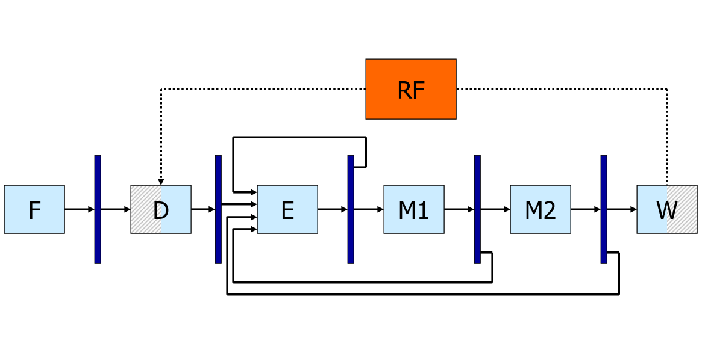

---

**Markdown** version on
[*github*](https://github.com/caillouc/Fiche_EPFL/blob/main/Advanced_computer_architecture/Advanced_computer_architecture.md?plain=1)  
Compiled using [*pandoc*](https://pandoc.org/) and [*`gpdf` script*](https://github.com/caillouc/dotfile/blob/linux/gpdf.sh)  

\clearpage

# General Purpose Architectures

## Exploiting ILP Dynamically

### Pipelining

* **ILP** : Instruction Level Parallelism
* **Pipelining** is a simple form of ILP : Several instructions are being
  executed at once
  * The *latency* is unmodified
  * The *throughput* is higher
  * Adding resgisters to cut combinatorial logic
  * Each new register add a bit of latency and increase the power consumption
  * **Dependencies** slow down the possibility of pipelining
    * To detect dependencies we can simply have a look to the destination
      registers of intermediaire registers and verify that they are not needed
      by the instructions that have been fetch
    * Either add logic to detect dependencies (hardware) and stall the pipeline
      or requires the right number of nop between instructions to avoid issues
      (compiler)
  * Several instructions are run in parallel
  * **Control hazards** limit the usability of the pipeline
    * Must squash fetched and decoded instruction following a branch
  * **Data hazards** limit the usability of the pipeline
    * Whenever the next instruction cannot be executed, the pipeline is stalled
      and no new useful work is done until the problem is solved
    * Can be solved by forwarding newer values (bypass the register file)
  * **Rigid sequencing**
    * Special "slots" for everything even if sometimes useless (e.g. MEM before
      WB)
    * Every instruction must be coerced to the same framework
    * Structural hazards avoided "by construction"
* **Dynamic Scheduling** : solve dependencies in hardware



### Dynamic Scheduling

* While waiting for a dependency to be resolved, schedule other instruction
  * Instructions can be executed out of program order (but the result must still
    be correct)
* Dynamic scheduling allow **Binary compatibility**, the same code will work for
  different processors, Parallelism is handle in hardware on not by the compiler
* **Structural hazars**
  * Are the required resources available ?
  * Previously handled by rigid pipeline
* **Data hazards**
  * RAW : Are the operands ready to start execution
  * WAR and WAW : The new data overwrite something which is still required
* **RAW** : Read after write
* **WAR** : Write after read
* **WAW** : Write after write
* Dynamic pipelines may create WAW hazards
* Register after the decode state is bigger since it must be abble to store
  several instructions. A **reservation station** checks that the operands are
  available (RAW) and that the execution Unit is free (Structural Hazard), then
  starts execution
  * Unavailable operands are identified by the name of the reservation station
    entry in charge of the originating instruction
  * *Tag* keeps track of which instruction will generate the result I am waiting
    for. Tag here are the name of an entry of the reservation station
    * *Tag* cannot be register name since they are not unique
    * *Tag* cannot be the PC (even tough it looks unic) since we can have a
      branch in a loop for example
  * Can find dependencies using the reoder buffer (see later)
    * Reorder buffer keeps track of all instructions that have not been commited
      yet
    * Reorder buffer can be used to bypass the register file
* **Implicit register renaming** removes WAR and WAW hazards
* New results are seen at their inputs through special results bus(es)
* Writeback into the registers can be done in order or out of order
* **Architectural states** are known by the programer
* **Microarchitectural states** are not known by the programer, only used by the
  processor
* Exception handler should know exactly where a problem has occured, especially
  for **non terminating exceptions** (e.g., page fault) so that they handle the
  event and resume exactly where the exception occured
  * *Precise exceptions* : Reordering at commit; user view is that of a fully
    in-order processor
  * *Imprecise exceptions* : No reordering; out-of-order completion visible to
    the user
* A processor can do *whatever it wants* provided that it gives the *appearance
  of sequential execution*
* **Reorder buffer** (ROB) : redorders instructions in the commit unit
  * Pointer to the head and to the tail
  * Every time I decode an instruction, I add it to the Reorder buffer with the
    corresponding *tag* and the destination register
  * During execution *tag* are replaced by actual values/results; more precisly
    the only instruction with the given *tag* will be updated
  * When the head pointer is ready (results has been computed) we can commit;
    Otherwise we wait and do not commit any instructions
  * PC is also stored in the Reoder buffer to remember where was an eventual
    exception. This way wen can rejump to this instruction once the exception
    have been handled (or not, for terminating excepetion)
  * There is an address destination slot as well as a register destination slot.
    Either the register or the address slot is used, because the results has to
    be written either to memory or to a register
* Informations/results bypass the register file in order to be reuse faster,
  however in register file results are in order
* When a synchronus exception happens, we do not report it but we **mark the
  entry** corresponding to the instruction which caused the exception in the ROB
  * When we would be ready to **commit** the instruction, we **raise the
    exception** instead
  * We also **squash** the content of the ROB and of all RSs
* The way to detect and resolve dependencies through memory is the same as for
  registers; For every load, check the ROB
  * If there is **no store to the same address** in the ROB, get the value from
    memory
  * If ther is a **store to the same address** in the ROB either get the value
    (if ready) or the tag
  * If there is a store to an **unknown address** in the ROB or if the address
    of the load in unknown, **wait**
* Additional memory dependencies can be solved via a **Load Queue** and a
  **Store Queue** (mimic the ROB). They would replace the memory reservation
  station
  * Load queue entries have a pointer to an entry in the store queue to know
    every store that where before the load
* Last improvment is Superscalar, having several fetch and decode units as well
  as several alu and memory units


### Renaming registers

* **Register renaming** is used to get rid of WAR and WAW
* **Location for rename registers**
  * Merged rename and architectural RF
  * Slpit rename and architectural RFs
  * Renamed values in the reorder buffer
  * Renamed values in the reservation stations (a.k.a. shelving buffers)
* Tracking the mapping table: Where  is Physically an Architectural Register
  * Mapping in a **Mapping table**
  * Renaming in the **Rename buffer**
* **State Transition in a Merged file + Information flow**
  * Initialization : First $N$ registerss are 'AR', others are 'Available'
  * *Available* $\rightarrow$ *Renamed Invalid* : Instruction enter the
    Reservations Stations and/or the ROB: register allocated for the result
    (i.e., register uninitialised)
    * Read new PhR from top of Free Register Table
    * Create new mapping *LogDest* $\rightarrow$ *Dst* in the mapping table
    * Set corresponding *Busy-Bit* (=invalid) in the Status Table
  * *Renamed Invalid* $\rightarrow$ *Renamed Valid* : Instruction completes
    (i.e., register initialised)
    * Write PhR *Dest* indicatied in the I-Queue
    * Reset corresponding *Busy-bit* (=valid) in the Status Table
    * Mark as *Done* in the corresponding entry in the ROB
  * *Renamed Valid* $\rightarrow$ *Architectural Register* : Instruction commits
    (i.e., register "exists")
    * Implicit (removal of historical mapping *LogDest* $\rightarrow$ *Dest*)
  * *Architectural Register* $\rightarrow$ *Available* : Another instruction
    commit to the same AR (i.e., register is dead)
    * Free PhR indicated by *OldDest* in the entry removed for the ROB
  * *Renamed Invalid* and *Renamed Valid* $\rightarrow$ *Available* : Squashing
    * Restore mapping from all squashed ROB entries (from tail to head) as
      *LogDest* $\rightarrow$ *Dest*
    * Reset corresponding *Busy-Bit* (=valid) in the Status Table
* **State Transition Replaced by Copying in Stand-alone RFF**
  * Initialization : All Rename registers are "Available"
  * *Available* $\rightarrow$ *Renamed Invalid* : Instruction enter the
    Reservation Stations and/or the ROB: register allocated for the results
    (i.e., register uninitialised)
  * *Renamed Invalid* $\rightarrow$ *Renamed Valid* : Instruction completes
    (i.e., register initialised)
  * *Renamed Valid* $\rightarrow$ *Available* : Instruction commits (i.e.,
    register "exists") $\Rightarrow$ Value is copied in the Architectural RF
  * *Renamed Invalid* and *Renamed Valid* $\rightarrow$ *Available* : Squashing
    (no copy to the Architectural RF)
  


### Predictions and Speculation

* How do I make a good guess ?
  * Either one outcome is typical and far more frequent : *Static prediction*
  * Or I need to remember some history : *Dynamic prediction*
* What do I do if the guess was wrong ?
  * Undo speculatively executed instructions ("squash")
    * May or may not cost something
* **Exceptions**
  * **Prediction**, For every instruction, we have guessed that there will be no
    exception (static prediction)
  * **Speculation**, In case of exception we have used the ROB to squash all
    instructions after the faulty one raising exception
* General Idea (our ROB does just that) :
  * After a prediction, hold every potential change in state of the processor
    (e.g., register values, memory writes) in a buffer
  * If the prediction turn out to be correct, let the content of the buffer
    affect the state (= commit)
  * If the prediction turns out to be wrong, simply squash the content of the
    buffer
* **Branch Preciction**
  * *Static* : Maybe we can assume that every backward branch is part of a loop
    and thus usually taken
  * *Dynamic* Maybe we can observe what happens during execution and learn
* **Branch Speculation**
  * In a simple pipeline we may simply fetch and decode instructions
    $\rightarrow$ easy, no state changes
  * In a complex out-of-order superscalar we may really execute instructions
    speculatively $\rightarrow$ ROB
  * Predicted branches are inserted in the ROB with predicted target
    * A predicted branch whose outcome is unknown cannot be commited
    * If $outcome = address$ then we can commit (= correct prediction) (in
      reality we do not commit the instruction, it is simply moving the head)
    * If $outcome \neq address$ then we do not commit and squash everything
* **Branch target Buffer** : Map between Branch Addresses (PC of the branch) and
  Target Addresses (fully associative)
  * To make this cheaper we can split the PC in an index entry (7 last bits for
    example) and a TAG (other bits). An entry could contains several TAGs.
* **Branch history table** : Part of the branch PC correspond to the index of
  the table and one bit prediction is stored at this location. However this
  table does not store the address of the branch. This allow collision but is
  cheaper. The prediction can also be over two bits.
  * One bit predictor : do the same as last time
  * Two bit predictor (saturing counter) : adding some "inertia" or "take some
    time to change your mind"
  * Modified two bit saturating counter : Two mispredictions $\rightarrow$ stong
    reversal (instead of weak for default two bit predictor)
* **Exploit correlation** : *(m, n) Branch Predictor Buffer* A global m-bit
  predictor uses the outcome of the last four different predictors
* **gshare** : replace concatenation with a better hash function
* **Return address stack** stores return address in the processor and use them
  for jump predictor without having to deal with the stack
  * Misprediction has high cost
* **Memory dependencies**
  * **Prediction**
    * We can optimistically assume that there is *no dependence* (it is the only
      asssumption that makes us gain time and the opposite assumption never
      leads to a functional mistake ...)
    * One could certainly do better than simply assuming that any potential RAW
      through memory is not a RAW (= simple **static dependence prediction**)
    * The goal is to reduce the probability of squashing and replaying (if
      squashing costed nothing, the prediction would be ok, but squashing almost
      invariably has a cost - and definitively in terms of energy)
    * Essentially one could build **dynamical predictors** similar in spirit to
      branch predictors (the intuition is that dependences are program specific
      but often **stable** during program execution) $\rightarrow$ learn from
      history and remember what happens on previous visits of a load
    * In fact, one could even predict a specific dependence (**alias
      prediction**-that is, in which strore a given load depends) and use it to
      bypass memory before addresses are known
  * **Speculation**
    * If there was a dependence every data dependent instruction should be
      squashed; independent instructions were actually correctly executed
    * If we accept to squash *all* following instructions, this situation is not
      qualitatively different from what we have seen for other cases
      $\rightarrow$ ROB
* Predicting the next miss
  * Fetch data into the cache ahead of processor demanding it
  * **Predition**
    * *What* and *when* to get from memory
    * As usual, exploit *typical behavior* (e.g., programs are sequences of
      instructions) and learn from (*execution history*)
  * **Speculation**
    * Since we are putting data in the cache (which is not architecturally
      visible), *nothing to do to rollback*
    * Still, prefetching has a *cost* (besides energy, it consumes memory
      bandwidth) and could be damaging (leads to eviction of useful stuff)
* **Prefectching**
  * **Coverage**: How many misses prefetching removes
  * **Accuracy**: How many prefetched cache lines are useful over all
    prefetched lines
  * Sort of a trade-off :
    * prefetching very *agressively* improves coverage but reduces accuracy
      $\rightarrow$ pollutes the cache
    * prefetching *conservatively* may improve accuracy but reduces coverage
      $\rightarrow$ little benefit
  * Simple idea
    * If the cache line $X$ is a miss, load $X$ but also $X+1$
    * Do not load $X+1$ immediately but wait until the processor asks for an
      instructions some *fetch-ahead-distance* from the end of the line
    * Could also load $X+N$ instead. If $N$ is too small $\rightarrow$ poor
      coverage and if $N$ is too large $\rightarrow$ poor accuracy
  * **Stride prefetching**
    * On a request for $X$, prefetch $X+S$, $X+2S$, ...
    * Ussually takes a few misses to detect and build confidence in a constant
      stride
* **Stream buffer**
  * There may be various streams mixing
  * Aggressive prefetching of multiple streams leads to cache pollution
  * Implements multiple Next-N-Line or Stream prefetchers
  * Place the prefetched lines in FIFO buffer instead of the cache
* Speculation is not necessarily a Run-Time Concept
  * Dynamic : in hardware, no interaction whatsoever from the compiler
    * Binary code in unmodified
  * Static : in software, planned beforehand by the compiler
    * Binary code is written in such a way as to do speculation (with or withour
      some harware support in the ISA)
* **Predicated (= guarded) execution**
  * A special form of static control speculation, "I cannot make a good
    prediction ? I will avoid gambling and will do both"
  * A bit more than that : removes control flow change altogether
  * Not always a good idea : compiler tradeoff
    * (Almost) free if one uses execution units which where not used otherwise
    * Not free at all in the general case : more than needed is always executed

+------------------+--------------------------------+------------------------------+
|                  | **Dynamic** (by the hardware)  | **Static** (by the compiler) |
+:================:+:===============================+:=============================+
| **Exceptions**   | * Out of order and reordering  |                              |
|                  | * Imprecise exceptions in DBT  |                              |
+------------------+--------------------------------+------------------------------+
|                  |                                |                              |
+------------------+--------------------------------+------------------------------+
|                  | * Branch prediction            | * Trace Scheduling           |
| **Control**      |                                | * Hyperblocks                |
|                  |                                | * Prediction                 |
|                  |                                | * Prediction                 |
+------------------+--------------------------------+------------------------------+
|                  |                                |                              |
+------------------+--------------------------------+------------------------------+
| **Data**         | * Virtual memory               |                              |
| **Availability** |                                |                              |
+------------------+--------------------------------+------------------------------+
|                  |                                |                              |
+------------------+--------------------------------+------------------------------+
| **Data**         | * Load/Store Queues            | * Advanced Loads             |
| **Dependence**   |                                |                              |
+------------------+--------------------------------+------------------------------+
|                  |                                |                              |
+------------------+--------------------------------+------------------------------+
| **Data**         |                                | * Dynamic compilers          |
| **Value**        |                                |                              |
+------------------+--------------------------------+------------------------------+

### Simultaneous multithreading

* Multithreading : pick other program instructions to fill empty slots
  * Fetch from mutltiple threads
* Processor must be aware of several independent states, one per each thread
  * Program counter
  * Register File
  * Memory
* Either mutltiple resources in the processor or a fast way to switch across
  states
* **Vertical waste**: Complete idle cycle
* **Horizontal waste**: Partially filled cycle
* **Cycle by Cycle interleaving multithreading** (or Fine-Grain multithreading)
  * Round robin selection between a set of threads
  * Requires several Pragram counter and register file
  * Would allow to remove some forwarding path (since two instructions does not
    belong to the same thread, they canot depends on each other)
  * The single thread latency is increase by a factor $N$
    * It is no acceptable that single thread performance goes significantly down
      or at all
  * Null time to switch context
    * Multiple Register Files
  * No need for forwarding paths if threads supported are more than pipeline
    depth
    * Simpler hardware
  * Fills well short vertical waste (other threads hide latencies)
  * Fills much less well long vertical waste (the thread is rescheduled no
    matter what)
  * Does not reduced significantly horizontal waste (per thread, the instruction
    window is not much different)
  * **Significant deterioration** of single thread job
  * $\Rightarrow$ never really used
* **Block interleaving multithreading** (or Coarse-Grain multithreading)
  * Keep executing a thread until something happens
    * Long latency instructions found
    * Some indication of scheduling difficulties
    * Maximum number of cycles per thread executed
  * Scheduling of threads not self-evident
    * What happends of thread #2 if thread #1 executes perfectly will and leaves
      no gap
    * Explicit techniques require ISA modifications
  * More time allowable for context switch
  * Fills very well long waste (other threads come in)
  * Fills poorly shoirt vertical waste (if not sufficient to switch context)
  * Does not reduce almost at all horizontal waste
* **Simultaneous multithreading (SMT)**
  * *Prioritised scheduling*
    * Thread #0 schedules freely
    * Thread #1 is allowed to use #0 empty slots
    * Thread #2 is allowed to use #0 and #1 empty slots
    * etc.
  * *Fair Scheduling*
    * All threads complete for resources
    * If several threads want the same resource, round-robin assignment
  * Multiple program counters (= threads) and a policy for the instruction fetch
    units to decide which threads to fetch (*Fetch and decode stage*)
  * Multiple or larger register files with at least as many registers as logical
    registers for all threads (*Commit stage*)
  * Multiple instructions retirement (e.g., per thread squashing)
    * No change needed in the execution path
  * Thread aware branch prediction
  * Per thread Return Address Stacks
  * Need to add a thread field in the ROB, to commit to the register of the
    right thread
    * No need to add this field in the reservation stations
  * Very good performance
* **Where to fetch**
  * **Static** solutions : Round-Robin
  * **Dynamic** solution: Check execution queues
    * Favour threads with minimal number of in flight branches
    * Favour threads with minimal number of outstanding misses
    * *Favour threads with minimal number if in flight instruction*
    * Favour threads with instructions for from queue head
  * Does not matter to much


## Exploiting ILP Statically

### VLIW Architecures and Compilers

* **VLIW** Very Long Instruction Word
* Schedule is to decide WHEN and WHERE each instruction is executed
* Scheduling happens at run time in superscalars and it happens exclusively at
  compile time in VLIWs
* Run time scheduling in superscalars requires considerable resources in the
  processor hardware
  * Reservation stations and reorder buffer
  * Renaming registers and various sorts of mapping tables
* **Static scheduling** : What each unit does in each cycle is decided at
  compile time in software
* **Superscalar processor**
  * **Hardware** detects parallelism among instructions
  * Scheduling is first performed at compile time, but with very loose
    information on the architecture the program will be run on
  * Final scheduling is performed at **run time**
* **VLIW (or EPIC) Processor**
  * **Software** detects parallelism among instructions
  * Scheduling is performed at compile time
* In traditional processor (superscalar) $cycles \neq instructions$
  * Latency-independent semantics
* IN VLIW processor $cycles = instructions$
  * Latency-dependent semantics
* **Area Advantage** : no need for the harware use in superscalar for dynamic
  dependence analysis $\rightarrow$ More execution units
* **Timing Advantage** : no need for complex dependence analysis every cycle
  $\rightarrow$ Clock frequency can be higher
* Challenges of VLIW
  * **Compiler Technology**
    * Compiler now responsible for scheduling
    * Most severe limitation until recently
  * **Binary Incompatibility**
    * Consequence of the larger exposure of the microarchitecture (=
      implementation choices) in the architecture
  * **Code Bloating**
    * All those NOPs occupy memory space and thus cost
    * But there are also other reasons ...
* **Code Bloating problem**
  * Larger code is a serious problem
  * In a fisrt approximation, the problem is due to the explicit NOPs
  * Not just a DRAM cost issue (main memory is cheap) but has weird impacts on
    cache performance (size, cache pollution, associativity, etc.)
  * Code compression : Differentiate Fetch Packet and Execute Packet
  * Instrucions are encoded in a less straightforward way
    * Separator bit $= 0$ : next operation is in parallel
    * Separatpr bit $= 1$ : next operations is sequential
    * Unit number : specifies where to execute operation
  * Price to pay for shorter code
    * Fetch/Decode logic more complex
    * Crossbar for shipping operations to the rights FU, complexity proportional
      to $n^2$
  * Hardware was supposed to be trivial and $\mathcal{O}(n)$ ...
  * A trivial but significant reason for bloating is removed
  * More fundamental and difficult to overcome reasons exist which still
    increase significantly the code size
* **The binary compatibility problem**
  * More information is now visible in the code
    * **Instruction latencies** used to enforece correct handling of data
      dependencies
    * **Available hardware parallelism** units scheduled on each cycle
  * More subtle sources of incompatibility
    * change in instructions latencies
  * No fully satisfactory solution exists today
  * Partial or research solutions
    * Recompile
    * Special VLIW coding/restrictions
    * Dynamic binary Translation is emerging
* Latency cannot increase
  * Trivially, higher latendcy may violate data dependencies
* **Compiler Technology problem**
  * Parallel exectution is limited by the need to find independent instructions
  * We need to deal with both data and control dependencies
* **Control dependencies**
  * If we have abundant resources (machine parallelism)
  * and we do not care about power dissipation, etc. but just look for performance
  * We can execute all paths in parallel without making a choice
  * Instructions can be executed in parallel, but they are commited only if the
    relative predicate is true
  * **Predicate Execution** needs architectural support, we need :
    * An instruction to set the predicate
    * Predicate registers
    * An additional field in the instruction word
    * A way to check and delay exceptions
    * **Full**: all instructions can be executed conditionally
    * **Partial**: typically a single conditional instruction
  * **Loop tranformations**
    * Loops are often the most important part of the code (in terms of fraction
      of total code)
    * Loops bodies can ce transformed so that more parallelism can be exploited
    * **Loop peeling** remove some iterations of the loops and add them after
      (change the total number of iterations)
    * **Loop fusion** : merge two loops in one (might need loop peeling)
    * **Loop unrolling** : Creating larger loop bodies $\rightarrow$ bigger
      basic block leeds to more chance for parallelism
* VLIW code fundamentally larger than standard code: not only NOPs are explicit,
  but aggressive unrolling multiples real instructions
* **Software pipelining**, goal : restructured the loop, so that ILP can be
  exploited
  * Prologue, Body and Epilogue
  * **Iterations** advancing in parallel
* Dependences : Trace Scheduling
  * Optimise the **most probable path** by increasing the size of basic blocks
  * Add compensation code in less probable paths
* **Compile time speculation**
  * **Register renaming** to ensure that correction code source operands are
    preserved
  * Because of **exceptions**, you only need to either:
    * **Avoid errors** : Speculate only instructions which cannot raise
      exceptions (but one wants to speculates loads)
    * **Resolve errors** : Add a special field in the opcode (Poison bit, ...)
      that says when an instructions has been speculated
* Elimination WAW and WAR at compile time
  * Rename: Eliminate dependencies by using more registers at compile time
    * Need more architecturally visible registers
* RAW is the only important one : moving a load above a store
  * At runtime we have more information on memory addresses
  * But a **compile time** we have **more time available**: we can make much
    more complex analysis which depend on a wider knowledge of the code
* Conclusion on VLIW compilers
  * Many different decisions
    * Which type of region is right? Trace, superblocks, hyperblocks,
      treeregions
    * Which regions to optimise
    * To unroll or not to runroll? How many times?
    * To predicate or not to predicate?
    * When to allocate resgisters
    * $\rightarrow$ powerful compiler backends for VLIWs are **very hard** to build

## Dynamic Binary Translation

* Single worst obstacle to processor evolution
* Translate/Optimize a binary file (*Source architecture*) to physical hardware
  (*Target architecture*)
* **Emulation** : terrible in term of performance
* **Static translation** : change the binary to fit the target architecture,
  should have good performance
  * **Code identification** : all code must be discovered statically and
    separated from embedded data
  * **Self modifying code** : what to do with it? Additional hardware to allow
    support of source architecture?
  * **Precise Exceptions** : no 1-to-1 relation between target instructions and
    source ones
  * **OS** : support of shared librairies and system calls
* **Dynamic Binary Translation** : merge emulation and translation to get the
  best of both worlds, see image below
* **Optimization to Translated Code**: ILP Scheduling, Loop unrolling, Alias
  analysis, Load store telescoping, Copy propagation, Combining, Unification,
  Limited dead code elimination
  * These optimizations are now simpler since we saw the code behaviour several
    time
* Now inside the porcessor we have a DBT (Dynamic Binary Translation) engine,
  located between the OS and the VLIW Processor
* **Difficult Problems for DBT**
  * **Code discovery** : Not a problem anymore, wince we are in the middle of the
    emulator
  * **Self modifying code** : injected code is not translated thus would lead to
    issues
    * If we detect the injected code, we can simply jump back to the emulator
      part (in blue in the image)
    * Use the TLB to detect when one writes to the code and thus detect *sefl
      modifying code*
  * **Asynchronous exception**
    * Can be delayed, no big deal
    * Wait until end of group
    * Translate exception handler
    * Invoke translated exception handler
  * **Synchronous exceptions**
    * During emulation, no issue
    * If synchronous exception during the execution of a translated and
      optimized group of VLIW instructions, unclear instructions and state
      w.r.t. source architecture
    * Revert status to begenning of current translated group (needs some
      architectural support : Set of *shadow registers* (which get the value of
      the main registers at at the end of a group) and gated *store buffer*
      (which holds pending stores for commit at the end of a group)
    * Re-emulate source architecture to find the exact point of the execution
      and to leave the processor in the architecturally correct state
    * Invoke translated exception handler
* Additional Optimization in BDT
  * **Block Reordering**: Make target image execution as sequential as possible
  * **Memory Colouring**: Improve mapping of translated code to fit target
    memory hierarchy
  * **Code Specialization**: Clone procedures based on constant parameter values
* **Benefits** of DBT
  * Compatibility
    * With native implementation
    * Across different VLIWs sizes and generations
  * Reliability and possibilities to upgrade
    * Software patches for bugs in translator
    * Software patches for optimizer enhancements
    * Translator can be used to hide hardware bugs
  * Low hardware cost
    * SW scheduler: smaller chip with higher yield
    * Fast in-order implementation
  * Higher instruction-level parallelism
    * Dynamic groups can be made arbitrary large
  * Low-power consumption
    * Memory consumes less than logic: Schedule once and then fetch from memory
      (?)
* **Issues** of DBT
  * Reduced resources from the user
    * Cycles: lost performance for translation
    * Memory
  * Slow at start (emulation) and real times difficulties
  * Debugging difficulties
    * Target machine code far removed from source code
    * Non-deterministic behavious or real systems
* Static optimization in compiler backend is limited
  * Tranlate with the same source and target architecture : **dynamic
    optimisations**
    * Identify long instruction groups (*traces*)
    * Extends traces over
    * Optimize traces: classic ILP optimizations remove unconditional branches,
      ...
  


# Application-Specific Computing

## Instruction Set Extensions and High-Level Synthesis

* Increasing the efficiency of implementations (from C programs to more
  efficient programmable solution)

### Automatic Processor Customization - Instruction Set Extensions

* Collapse a subset of the Direct Acyclic Graph node into a single Functional
  Unit (AFU)
  * Exploit cheaply the parallelism within the basic block
  * Simplify operations with constant operands
  * Optimize sequences of instructions
  * Exploit limited precision
* Using hardware for special functional unit
* Why hardware is better ?
  * Spatial computation
    * Cheap ILP without true ILP support
  * No quantization of time in clock for each operation/instruction
    * Operation chaining
  * Hardware is a different
    * Constant may be propagated
    * Precision can be tuned (bitwidth analysis)
    * Arithmetic components can be optimized
    * Arithmetic operations often appear in groups
    * A literal/sequential implementation may not make the best of the potential
      available
    * A different number representation can be game-changer
* **Automatic ISE Discovery**
  * Formulate it a an optimization problem
  * "Give me your application in C, let me zoom in and let me try to find the
    biggest part that I can take so that I convert this into hardware, I put
    them as a functional unit of my processor and whenever you give me that
    program, instead of going and resorting to the normal functional unit, I do
    it on this special functional unit"
  * Find subgraph
    * having a user-defined maximum number of inputs
    * convex
    * possibility including disconnected components and
    * that maximise the overall speedup
* **Processor customisation**
  * Arguably the **most widespread method of designing embedded hardware**:
    selection one of very many existing processor or configuring the parameters
    of a family of precessors amounts to customization for a set of applications
  * **Little automation**, thought: still moslty a manual design-space
    exploration; glimpses of automation in the 2000s seem lot
  * Autimatoc ISE discovery could be a more promising automatic customization
    opportunity, but also disapeared in the late 2000s
    * Pros: Focus on automatic design of datapath and leave control to manually
      optimized processors (prediction, speculation, etc.)
    * Cons: Limited scope of exploitable parallelism (datapath parallelism and
      convertible control, predication, unrolling)

### Statically Scheduled High Level Synthesis

* Somehow, ISE is confined to dataflow or convertible control flow, and this
  limits exploitable parallelism
* Traditional **HLS** gets rid of the processor altogether and uses the C/C++
  specification to build hardware
* It represents an attempt to raise the abstraction level of hardware design
  above the classic RTL level (i.e., synthesizable VHDL and Verilog)
* Same as VLIW scheduling ?
  * Very similar problem but with some notable differences
    * Exact resources are not fixed; maybe there is a constraint on their total
      cost
    * Clock cycle may be constrained but is in general not fixed; pipelining is
      not fixed
    * No register file (which allows connecting everything to everything) but
      had-hoc connectivity
* **Manual Code Refactoring**
  * Direct results are very often highly suboptimal
    * Naive FIR
  * users should have a sense of what curcuit they want to produce and suggest
    it to HLS tools by restructuring the code
  * HLS tools today are *not* really meant to *abstract away hardware design
    issue* from software programmers; in practice, they are more like
    productivity tools to help hardware designers explore quickly the space of
    hardware designs they may wish to produce
  * **Loop peeling**
  * **Loop Fission**
  * **Loop unrolling**
* **Pipelining**
  * Perfect pipelining cannot be achieved easly by rewriting the code
  * We need to schedule differently the operations within a loop so that
    operations of different iterations take place simultaneoulsy
  * Remember "software pipelining" How we need it so that a software program
    reprepresents a hardware pipeline
  * HLS needs to implement some form of modulo scheduling
* Classic HLS and VLIW Compilation
  * Striking resemblance of the two undertakings
    * Both try to produce a **static schedule**  of operations
    * Both try to reduce to a minimum **control decisions**
  * Both suffer from **similar limitations**: they cope poorly with variability
    including varibale latency operations, uncertain events, such as memory
    dependencies, unpredictable control flow
  * Both impose **burdens onto the user**: decisions on how where to apply
    optimizations are not self evident, depend on the particular combination of
    the user constraints (note that the solution space is much wider for HLS),
    and thus are often left to user through code restructuring or pragmas

### Dynamically Scheduled High Level Synthesis

* Limitation of Static Scheduling : When an operation depends on a load, we need
  the load to finish to check for dependencies
* **Asynchronous circuits** : operators triggered when inputs are available
* Dataflow, latency-insensitive, elastic: the **synchronous** version of it
* Every components communicates via a pair of handshake signals
* The data is propagated from component to component as soon as memory and
  control dependencies are resolved
* Functional units, the only difference, they wait for the operands to be true
* *Fork* : takes a token and slipt the token  to a number of users
* *Join* : wait for all token to arrive at his input and let them pass
* *Branch* : represents decisions
* **Synthesizing Dataflow Circuits**
  * C to intermediate graph representation
  * Constructing the datapath
  * Implementing control flow
  * Adding buffers
    * Buffer insertion does not affect circuit functionality
    * Each combinatorial loop in the circuit needs to contain at least one
      buffer
* Backpressure from slow paths prevents pipelining
  * Insert FIFO into slow paths
* Dataflow circuits have **no notion of program order**
  * Which is needed for a Load Store Queue and handle memory dependencies
* An **LSQ for dataflow circuits** whose only difference is in the *allocation
  policy*:
  * *Static knowledge* of memory accesses program order inside each basic block
  * *Dynamic knowledge* of the sequence of basic blocks *from the dataflow
    circuit*
* Long control flow decision prevents pipelining
* **Speculation** in dataflow circuits
  * Contain speculation in a region of the circuit delimited by special
    components
    * Issue speculative token (pieces of data which might or might not be
      correct)
    * Squash and replay in case of misspeculation
    * New components : Speculator, Save units, Commit units
  * Extending dataflow components with a speculative flag
    * An additional bit propagated with the data or OR'ed from all inputs
  * To increase performance we can merge the Save and Commit unit on cyclic
    paths
* What to expect from Dynamic HLS
  * Two hopes derived from the VLIW vs OoO analogy
    * Significant better performance in control dominated applications with poorly
      predictable memory accesses
    * Better out of the box performance
  * The former is almost certain, the second less so
  * A major issue is the **hardware overhead** of supporting dynamic schedules
  * Probably statically scheduled HLS remains the best choice for classic DSP-like
    applications

## Challenges of High-Level Synthesis

* Variable latencies in computation, memory accesses, or loop execution time
  * Floating point units, cache hit/miss, viriable loop bounds, early-exit
    execution
  * Prevent good pipelining using standard HLS techniques
* Static HLS: assume the **worst case latency**
  * Reserve additional pipeline stages for variable latency operations
  * **Hardware overhead** in area (power timing) $\rightarrow$ may not be
    feasible for larger latencies
  * High throughput in particular case (e.g., no loop carried dependencies on
    variable latency op)
* Static HLS: stall **entire pipeline** in case of a variable event
  * Schedule each operation on its **minimum latency**
  * If an operation does no complete within min. latency block operations and
    *stall pipeline*
* **Dynamic HLS** naturally handles variable latencies
  * Handshaking mechanism stalls long-latency operations
  * Other computations can advance during stall
  * Howerver, in an in order system, pipeline usage and parallelism may still be
    limited
* Separate varible-latency memory accesses and computation
  * Data is loaded from memory, stored in FIFOs, and sent to execution datapath
    as soon as ready
  * Requires nontrivial **code restructuring** (by user or compiler)
  * Some schemes support **out-of-order** execution
* Out-of-order **multithread** pipelines
  * Loop iterations are tagged iterations which can execute out-of-order
  * Suspended thread occupied resources, subsequent threads can continue without
    stalling 
  * Qualitatively the same results as A/E decouplinng but can be applied to many
    variable latency op
* In addition to operation, the **number of loop iterations** can also be
  variable
  * E.g., loop bounds computed at runtime, early exit condition
  * As in the case of variable-latency operations, not trivial to handle with
    standard HLS
* Static HLS: start a new inner loop **only when previous one completes**
  * When all loop bounds are known, loops can be analysed statically and
    flattened
  * In general case: exit inner loop, compute new loop bounds, enter inner loop
* **Access/Execute decoupling** works here, but the transformation is even more
  complex
  * Compute loop bounds and enqueue into FIFO
  * Dequeue bounds, compute loop loads, and enqueue into FIFO
  * Dequeue accessed data, execute loop operations
* **Dynamic scheduling** naturally starts a new loop **as soon as pipeline is
  ready**
  * No special mechanism or transformation required
* **Loop Carried Dependencies**
  * In order pipelines
    * Different operations execute **out of order** with respect to each other,
      but each operation processes its own data **in order**
    * Limited throughput in case of **long latency loop-carried dependencies**
* Out fo order execution to increase throughput 
  * Issue multiple inned loops in parallel
  * **Multithreaded execution**
* **Spacial Parallelism**
  * Instruction-level parallelism within a **single datapath**
  * **Replicate datapath/kernel** to increase parallelism
  * Challenges:
    * How to express the parallelism to the computer
    * How to maximize utilisation of each datapath
* **Loop Unrolling**
  * **Standard unrolling**: replicate computations within a loop 
    * Achieves spacial parallelism in regular loops
    * Not suitable for irregular code
* **Task parallelism** (loop replication)
  * Replicate loop and execute **multiple loop instance** in parellel
    * Difficult to express using a C based HLS tool 
    * Increase parallelism, but datapath not fully used if inner loop latencies
      differ
* **Load balancing** to maximize parallelims and kernel utilization 
  * Dispatch computation to processing units based on availability
* Summary
  * Access/execute decoupling, multithreading, dynamic scheduling
    * Dealing with variable-latency events
    * In-order: adapt the schedule to particular outcomes
    * Out-of-order: fill gaps ins schdule to particular outcomes
  * Loop replication for spatial parallelism 
    * Unrolling irregular loops and loops nets
    * load balancign to maximise datapath utilization

## Digital Signal Processors

* **Embedded Systems**
  * Application specific:
    * Application fixed in advance
    * Not or very moderately programmable by the user
  * Reactive:
    * Reacts on events coming from the environment
    * Has real time constraints
  * Efficient:
    * Cost reduction must profit from specialisation
    * Low power, small size, ...
* **Specificities of Embedded procesors**
  * Cost used to be the only concern; now **performance/cost is at premium** and
    still not performance alone as in PCs; Performance is often a constraints
  * **Binary compatibility** is less of an issue for embedded systems
  * System-on-chip make **processor volume irrelevant** (moderate motivation
    toward single processor for all product)
* **Cost in performance**
  * **Performance is a design constraints**
    * *General purpose*: new high-end processor must be tangibly faster than
      best in class
    * *Embedded*: adequately programmed, must just satisfy some minimal
      performance constraints
  * **Cost is the optimisation criteria**
    * *General purpose*: must be within some typical range $\rightarrow$ profit
      margin can be as high as some factor
    * *Embedded*: must be **minimal** $\rightarrow$ economic margin on the whole
      product can be as low as a few percent points
* **Typical features of DSPs**
  * Arithmetic and datapath
    * Fixed-point arithmetic support
    * MAC = multi-accumulate instruction
    * Special registers, not directly accessible
  * Memory Architecture
    * Harvard architecture
    * Multiple data memories
  * Addressing modes
    * Special address generators
    * Bit reversal addressing
    * Circular buffers
  * Optimized Control
    * Zero overhead loops
  * Special purpose peripherical
* **Fixed point**
  * In principle, if one adds a fractional point in a fixed position, hardware
    for integers works just as well and there are no additional ISA needs
    * It is just a matter or representation
  * Multiplication typically introduces the need of arithmetic rescaling with
    shifts to the right (multiplicative constant cannot be implicit anymore)
    $\rightarrow$  Choice of accuracy depending on how many bits one can keep
  * Different approximation choices
    * **Truncate**: Discard bits $\rightarrow$ *Large bias*
    * **Round**: $< .5$ round down, $\geq .5$ round up $\rightarrow$ *Small
      bias*
    * **Convergent Round**: $< .5$ round down, $> .5$ round up, $= .5$ round to
      the nearest even $\rightarrow$ *no bias*
* DSP Arithmetic needs
  * Rather than having full floating point support (expensive and slow), one
    wants in a DSP some *simple and fast* ad-hoc operations
    * MUL + ADD in a *single cycle* (MAC)
    * *Accumulation* register faster MAC
    * *Approximation* mechanism
  * Nouniform precision in the whole architecture
  * MAC operations tend to dominate DSP code (maybe 50% of critical code)
    $\rightarrow$ highly optimised MAC instruction
* DSPs have multiple memory ports
* DSP do not have caches
  * Importance of real time constraints: no data caches
  * Sometimes caches on the instruction memory but determinism is key in DSPs
    * Caches under programmer control to lock-in some critical instructions
    * Turn caches into fast program memory
  * Once again, one is not after highest performance but just guaranteed minimal
    performance one needs
* **Addressing modes**
  * To keep MAC busy all the time, with new data from memory, one need to
    generate memory addresses
  * Forget about Load/Store queue architecture
  * Complex addressing is now fully welcome if
    * Allows automatic next address calculation
    * Does not require usage of the datapath (MAC is busy...)
  * Dedicated simple datapaths to generate meaningful sequences of addresses,
    ususally 2-4 per DSP
  * AR can be loaded with
    * *Immediate load*: constant from the instrucion field into the pointed AR
    * *Immediate modify*: constant from the instruction field added to the
      pointed AR
    * *Autoincrement*: small constant added to the pointed AR
    * *Automodify*: value of the pointed MR added to the pointed AR
    * *Bit reversing*: value of the pointed AR bit-reversed and loaded into the
      pointed AR
    * *Modulo/circular*: autoincrement/automodify with modulo
    * Also decrement/substract
    * Sometimes pre- and/or post-modification

## Compilers and DSPs

* **Classic compiler Flow/Phases**
  * *Front-end*
    * Mostly dependent on programming language
    * Largely or fully independent of target machine
    * Source code $\rightarrow$ Source-level optimisations $\rightarrow$
      Source-code Analysis
  * *Back-end*
    * Mostly dependent on target machine
    * Largely of fully independent of programming language
    * IR optimisation $\rightarrow$ Code selection $\rightarrow$ Instruction
      scheduling $\rightarrow$ Register allocation $\rightarrow$ Assembly code
* **Standard code generation techniques** Standard Code Generation layering: Three fully independent phases
  * **Code selection**: *which* instruction to implement DFG node
  * **Instructions Scheduling**: *when* instructions will be executed at runtime
    (or considered for execution in dynamically scheduled processors)
  * **Register allocation**: *where* results should be stored
* **Code selection problem**
  * Find minimal cost cover of the DFG with instructions of the ISA
  * **Tree parsing**
    * Break DFGs in Data Flow Trees (DFTs)
    * Define a tree grammar
    * Tree is parsed from a leaves to root, patterns are matched to apply rules
      (= instantiate instructions) and labeled with possible costs, and cheapest
      solution is found by dynamic programming by traversing the tree again from
      root to leaves
    * Optimal results in $\mathcal{O}(n)$ time (for DFTs not DFGs)
* **Instruction Scheduling problem**
  * Find a sequence $S$ of instructions which *minimises* the total
    schedule length $L(S)$ under the folowing conditions 
    * *Dependencies*: each instruction cannot be scheduled before the time the
      predecossors are scheduled plus their respective latencies
    * *Resources*: an instruction can be scheduled only if there are available
      resources to execute it
  * NP-hard problem
  * Exact solutions are usually not practical for instruction scheduling
  * Greedy heuristic algorithm
    * At each step, maintain a ready list containing all the unscheduled
      instructions that can be scheduled respecting dependencies and resources
      availability 
    * Use a priority function to decide which instrunction from the ready list
      to start next
  * Priority function is the key and tries to maximise advantage
    * Pick instruction with the largest number of succesords, that is maximise
      size of future ready list
    * Pick instructions on the critical path or with minimal slack
    * Pick long latencies instructions
* **Register allocation**
  * Intermediate code uses infinite number of virtual registers
  * Virtual registers should be mapped to a limited number of physical registers
  * **Graph colouring**
    * Interference Graph edges represent the fact that two VRs cannot be mapped
      to the same PR
    * PR are "colors"
    * Nodes should be colored with at most $k$ colours and no adjacent nodes get
      the same colour
    * NP-complete problem
    * Several heuristics to find an approximation solution
* **Memory layout (aka, offset assignment)**
  * How to arrange data in memory in such a way that the typical access sequence
    can be done with only automatic address updates
  * Create an edge-weighted graph
  * An assignment is an Hamiltionian Path (= Path touching all node once)
  * The maximum weighted Hamiltionian Path is the best assignment (largest
    number of free accesses)
  * NP-hard problem
  * Not one, but a set of $k$ ARs which can be used
  * General problem is much more complex
  * Several ARs and MRs available, autoincrement range large than 1
  * Goal is to find partition the variables among the ARs and define a set of
    values in the MRs such that the access cost a minimal
  * Access cost is null if
    * Distance of new variable from last variable accessed with the used AR is
      within the autoincrement range
    * Distance of new variable from last variable accessed with the used AR is a
      value stored in a MR
  * Very complex nonlinear optimisation problem $\rightarrow$ nonoptimal
    optimisation algorithms
* **Address Register allocation**
  * How to make all accesses with a minimal number of registers and with onlly
    automatic address updates
  * With array accesses, no offset assignment possible 
  * Use of pointers make code unreadable but forces many DSP compilers to
    allocate ARs and use autoincrement
  * How to allocate ARs automatically from readable code
  * Create a single graph with accesses being nodes and edges from i-th to j-th
    accesses if 
    * j-th access follows i-th access and 
    * the two accesses are within range $r$
  * An assignment is a set of disjoint paths (each path = one register) covering
    the distance graph
  * An assignment with a minimal set of paths is the optimal solution
* Exploit registers in of pipelined datapath
  * Chained operations
    * Pipelined MAC
  * Many special registers
    * Dedicated pipelining 
    * Reduced pressure on general-purpose register file
    * Shorter instruction length (implicit operand addressing)
  * Architecturally visible pipeline
  * Each DFT mapped independently and intertree values passed via registers
  * Since registers are not orthogonal, choice of registers may be highly
    suboptimal for DSPs
* $\Rightarrow$ Coupling of three phases needed
  * Code selection
  * Register Allocation
  * Scheduling
* Scheduling and Partitioning  
  * Major difficulty is that one simultaneously looks for a partition $P$ and a
    schedule $S$
  * Scheduling problem with limited redources is already NP-hard and need
    heuristics 
  * Classic scheduling algorithms need either partitioning before or after,
    cannot do it together
* Summary
  * **Irregularity** can be used to make processors more effective in very
    specific situations (e.g., DSPs)
  * Resulting complexity in compilation is often the **need of phase coupling**:
    layered back-end complilation phases fail to exploit the specific features
    * Special Registers $\rightarrow$ Register allocation, Code selection, and
      Scheduling
    * Multiple Clusters $\rightarrow$ Partitioning and Scheduling 
    * SIMD Instructions $\rightarrow$ Register allocation and Code selection
  * **Regularity** of a processor essentially means creating an architecure
    where the usefulness of missing information acess phases is minimal (e.g.,
    all registers are equally usable for all instructions)

# Hardware Security

* **Software complexity**
  * OSes and hypervisors are too complex to be trusted bo te bug free
  * Who can trust OSes and hypervisors, **Secure proceccor architecture**
* **Microarchitectural side-channel** attacks
  * Sharing with other users gives them the ability to discover our secrets
    * Shared caches, shared processors (branch predictor, pieplines, etc.)
* Pysical monitoring attacks and **physical side-channel attacks** 
  * User cannot physically protect and their computing hardware
    * Hardware if often in the cloud
    * Hardware is embedded and remote (Internet-of-Things, IoT)

## Microarchitectural SideChannel Attacks

* A set of **extremely powerful attacks** which intimately depend on the
  microarchitectural features of our processor
* **Treat model**, specification of the threats that a system is protected
  against
  * **Trusted Computing Base** : what is the set of trusted hardware and
    software components
  * **Security properties**: what the trusted computing base is supposed to
    guarantee
  * **Attacker assumtions**: what a potential attacker is assumed capable of
  * **Potential vulnerabilities**: what an attacker might be able to gain
* **Confidentiality**: prevent the disclosure of secret information
* **Integrity**: prevent the modification of protected information
* **Availability**: guarantee the availability of services and systems
* **Isolation**: the possibility to prevent any interaction between users and
  processes, often to guarantee confidentiality and integrity
* **Dynamic random-access memory** (DRAM)
  * DRAMs are the densest (and the cheapest) form of random-access semiconductor
    memory
  * DRAMs store **information as charge in small capacitors** part of the memory
    cell
  * Charge **leaks off** the capacitor due to parasitic resitances $\rightarrow$
    every DRAMs cell need a **periodeic refresh** lest it forgets information
* To increase density (i.e, reduce cost) memory cells have become incredibely
  small ($\rightarrow$ *small storage capacitance, smaller noise margin*) and
  extremely close to each other ($\rightarrow$ small crosstalk capacitance)
* Frequent **activation of word lines** neighbouring particular cells between
  refreshes may **flip the cell states**
* **Disturbances erros** have been a know design of DRAMs since even, but
  failure in commercial DDR3 chips was demonstrated in 2014 : **Rowhammer**

```nasm
code: 
  mov (x), %eax   //read from address x
  mov (y), %ebx   // read from address y
  cflush (x)      // flush the cache for address x
  cflush (y)      // flush the cache for address y 
  mfence
  jmv code
```

* Rowhammer effectively **violates memory protection** ("if I can read, I can
  also write") which is a key ingredient to privilege separation across
  processes
* By accessing locations in neighbouring rows one could gain unrestricted memory
  access and privilege escalation
  * Allocate large chunks of memory, try many addresses, **learn weak cells**
  * Release memory to the OS
  * Repeatedly map a file with RW permissions to **fill memory with page table
    entries (PTEs)** 
  * Use Rowhammer to **flip (semirandomly) a bit in one of these PTEs** it will
    point to the wrong physical page
  * Chances are that this physical page contains PTEs too, so now **accessing
    that particular mapping of the file (RW) actually modifies the PTEs** not
    the file 
  * Attacker can arbitrary change PTEs and **memory protection is gone**
  * **Mitigations**
    * Error correcting codes may fail to detect multiple flips
    * Shortering the refresh intervals mitigates but does not solve problem;
      implemented in firmware by some vendors
    * Hard or impossible to avoid altogether without **changes in the DRAMs**
    * Increase electrical noise margins (costly)
    * Count indise the DRAM the number of row activations within a time window,
      **identify potential victims, and refresh** 
* An aside on DRAMs: Data Remanence
  * A completely different problem with storing data on capacitors: cells may
    leak information quickly in the worst case but very many do not leak much in
    typical conditions
  * Lowering significantly the device temperature (e.g., use spray refrigerants)
    makes **most cells retain charge for long time** (seconds to miniutes)
  * **Coldboot** attacks:
    * Cool a working DRAM device
    * Switch off 
    * Move the device to another computer or reboot a malicious OS
    * Read content (password, secret keys, etc.)
* A **covert channel** is an *intentional communication* between a sender and a
  receiver *via a medium not designed to be communication channel*
  * If we isolate critical process inside a virtual machine, a covert cahnnel
    may allow a rogue programme insidde of the isolated process (a *Trojean
    horse*) to leak secret to some malicious receiver without anyone to notice
    (no conventional communication channel visible)
* Attacks where the sender is the unsuspecting **victim** of the attack, who is
  **unknowingly transmitting information through a covert channel**, and the
  receiver is the attacker
* Sending (or leaking) information is a **side effect fo the normal operation of
  the victim**, either because of the hardware implementation of the system or
  because of the software implementaion of the victim, or both
* Covert and Side channel are either :
  * **Microarchitectural**
    * Based on the *existence* of microarchitectural state, that is state not
      (normally) visible to the programmer, because architecural state is know
      and thus, apart from bugs, inherently protected
    * Based on the *sharing of the hardware components* featuring such
      microarchitectural state
    * Physical replication and isolation may solve the problem
  * **Physical**
    * Based on the physical nature of the computing system
    * Potentially more difficult to fight, but also harder to exploit
* **Timing side channel attack**
  * Execution time reveals something on data
  * Blinding through constant time  
    * May need to fight compiler optimizations
    * Variability may arise from microarchitectural phenoma
* **Cache Side channel attacks**
  * Oldest and perhaps most powerful example of microarchitectural side chanel
  * Attacker can differentiate hits and misses using some high resolution timing
    measurment (e.g., processor cycles)
  * Victim memory accesses (= where the victim loads or store) reveal secrets
    * Accesses to an AES sbox() depend on the secret key
  * Attacker can run victim code
* **Evict+Time** Does the victim access location $X$ (in set $Y$) ?
  * Run the victim
  * Run the victim and time it
    * Fast because data are in the cache
  * Evict content from set $Y$ 
    * By replacing with attacker content
    * Making sure to pollute all ways
  * Run the victim and time it 
    * If this run is longer then the previous one, the victim accessed something
      is set $Y$
  * Problem
    * Relies on measuring the *precise execution time of the victim*
    * Repeats the *same execution*, so no variability in the executed code
    * Yet, timing may be affected by *environmental issues* (system call, branch
      prediction, etc.)
    * It is a small noise but may be comparable to the quantity being measure 
    * *Repeat many times*
* **Prime+Probe** What location (set) does the victim access ?
  * Fill all sets with the attacker content (*prime*)
  * Read all pieces of data for all sets and time each set 
    * Fast because data are in the cache
  * Run the victim
  * Read all pieces of data for all sets and time each set (*probe*) 
    * If step 4 takes longer than 2 for set $Y$ then victim accessed something
      in set $Y$
  * *Key advantage* now the attacker times their own code and not the victim's
    code, arguably allowing *better control of measurment noise*
  * Multiple level
    1. Fill set in LLC (prime)
    2. Fill set (= evict) in L1 (reprime) (do not evict from LLC), *Reprime*
       with element in the same set in L1 but in a different set in LLC
    3. Run the victim
    4. Find misses
* Many attacks to cryptographic algorithms involve trying multiple plaintexts
  and/or key hypotheses and ditinguishing between most likely and least likely
  over many attempts
* The attacker and the victim may be on *different cores*
  * Diffenrent core does not share first caches
* **Inclusion property** 
  * Whatever is in L1D is certainy in L2; whatever is in L2 is certainly in L3,
    etc.
  * Useful to maintain coherance 
  * It is interesting for an attack to try to attacker last layer caches, since
    there is more info
* Take advanteages of the hardware support for larges pages
  * Large pages $\rightarrow$ More memory waste but *more efficient managment*
    in applications with larger data footprint
  * Attacker needs administrator rights to set larger pages
    * Not a problem because they have them in their guest OS
* **Meltdown**
  * Catastrophic attack making possible **read all memory of a process**
    (included protected data)
  * By product of the way sime microarchitectural features are implemented 
  * Exploits **race condition** between memory access and protection checks
    * Ultimately exploits the microarchitectural nature of caches (something is
      left in the cache upon exception because *the cache is not part of the
      architectural state*)
  * The attacker executes a *forbidden access* and speculatively uses the result
    to obtain *non architectural side effect* that reveal the secrets before the
    forbidden access is squashed
  1. Execute a forbiden access
  2. and speculatively use the result
  3. with nonarchitectural side effect that reveal the secrets
  * Use the secret to access a location in memory, the access will be done
    speculatively, then check what data have been accessed (via the cache) and
    find back the index
* Possible mitigations for meltdown
  * The obvious solution is to *change the processor design*
    * Test privilege level before making the result of a speculative access
      available
  * The other line of mitigation is to *better isolate user space and kernel*
    space memory
* **Spectre**
  * Another catastrophic attack making it possible to **read all memory**
  * Addresses another shared resources: **branch predictors**
    * For simplicity, branch predictor are not thread specific
  * Exploits side effect of **mispredicted speculative exectution**
    * Mispeculation does not affect the architectural 
    * but it may affect microarchitectural structures
  2. Speculatively execute
  1. leaky code
  3. with non architectural side-effect that raveal secrets
* Possible mitigation for spectre
  * Hardware 
    * Disable speculative execution
    * Seperate branch predictor per process/thread
  * General software approaches 
    * Run only an application per processor
  * Partial and application-specific software appraoches
    * Add serialization instruction between branches and loads 

## Trusted Execution Environments
  
* First attempt to develop **architectural features to mitigate some of the most
  severe threats** to isolation and confidentiality
* **Isolation** = Confidentiality and Integrity
* The key to the ability of limiting the possible translation depends on the
  existnece of **processor privilege levels**
  * Some instructions can be *executed only in some privilege levels*
  * Instruction lowering the privilege level do not need to be restricted to a
    particular level: there is no harm in deciding that one can do less
  * Critical is the *mechanism to raise the privilege level*, of course
    * Link raising the privilege level to a predefined change in control flow
      (i.e., some form of jump): if the privilege level raises, only some
      specific code can be executed
    * Usually in the form of a *software exception instruction*: raise the
      privilege and then raise the execption to execute the exception handler
    * If the virtual memory mechanism has been used well to protect the
      excpetion handler code, there is confidence that when the privilege level
      is high, only the OS can be executing
* **Classic privilege level**
  * Traditionaly **multiple privilege levels** with varying capabilities tuned
    to some particular purposes
  * Lower levels *add the capabilities* of levels above
  * In practive, most processor evolved to have only two privilege levels:
    **user mode** and **kernel mode** 
* **Virtual Machines**
  * **Full virtualization**: run the very same OS and applications in the
    virtual machine that one would run on the bare hardware
  * Many reasons:
    * **Consolidation** of multiple small machines in a powerful one (lower
      cost and energy)
    * **Flexible deployment** (no need to buy a mahcine upfront)
    * **Lower dependence** from the *hardware* details (easy to move accross
      servers)
    * **Better isolation** (not processes of the same OS but different OSes) 
* **Software-base virtualization** 
  * Mostly the ingredient for process virtualisation enable also full
    virtualization:
    * Memory is accessed via TLBs violations results exception being raised,
      etc.
  * Achieving full virtualization on a CPU no meant for it is challenging
    * If guest OS needs to be isolatedd, they cannot run all in kernel mode
    * But if *guest OSes run a user mode*, how can they do their job
  * The classic approach is called **trap-and-emulate**
    * Guest OS will create exceptions when trying to do its normal job (loading
      TLB)
    * Hypervisor will check the pertinence and, if appropriate, emulate
    * May key data structures will be replicated (shadow page tables)
  * But some instructions simply behave differently in user and kernel mode
    * **Dynamic Binary Translation** to rewrite the functionality with user mode
      instruction
* **Hardware-Assisted virtualisation**
  * Introduce **ISA extensions and a hardware support** for full virtualization
    and progressively extend it
    * More privilege levels (Ring-1 Hyoervisor)
    * Another level of address translation (nested paging) supported by the
      hardware page walker
    * Interrupt virtualisation
    * IOMMU virtualisation (no clue what that is)
* More **high privilege levels**
  * **System managment mode** (ring-2)
    * Guarantee some managment functionality in firmware even if the OS or the
      hypervisor anr compromised accessible by dedicated interupts
    * Mastly used for power and thermal managment or handling hardware errors
  * **Platform Security Engine** (ring-3)
    * Physical isolation through a piece of hardware independent from the
      processor
  * Not just more level but **dedicated hardware** and **physical isolation**
  * Largely implement *security by obscurity*
* **Symmetric key Cryptography**
* **Public key cryptography**
* **One way hash functions**
  * Typically used for integrity: it should be impossible to create a new
    message or modify one such that it results in the same hash at the original
* **Hash trees** 
  * Recursive application of one-way hashses on a dataset split in blocks
  * Useful to keep hashes up to data in case of local changes: one need to
    *recompute the hash of the block where the change took place and of the
    parents*
* **Random Number Generators**
  * Main distinction
    * **Pseudo-random number Generators** are algorithm to produce from a few
      initial bits (a seed) a deterministic long string of random-looking numbers
    * **True random number generators** are typically hardware components which
      exploit physical phenomena (electrical of thermal noise, temperature
      vairations, etc.) to generate truly random numbers
  * TRNGs are slown thus often TRNGs generate seeds and PRNG generate strings of
    random numbers for practical use
  * TRNG can be sensitive to tampering or may provide *backdoors*
* **Physical Unclonable Functions (PUFs)**
  * Circuit exploiting intrinsic randim physical features to produce a
    fingerprint *uniquely identifying each chip*
* **Freshness** and **Nonces**
  * In **replay attacks**, an adversary intercepts a piece of data and *resends
    it at a later time*
  * The authentication and integrity of the message is guaranteed by the fact
    that the message was a genuine one once first sent - what is misses is
    **freshnes**
  * The typical solution is to introduce **nonces**, that is number used only
    once during the lifetime of the system: if a message contains a previously
    used nonce, it is not fresh
  * Nonces can be produced by *monotonic counters* for instance
* **Homomorphic encryption**
  * Form of encryption which allows *computing over encrypted data* without to
    the secret key
  * Ultimate solution to secure remote computation: user ships encrypted data,
    they get processed by an untrusted party who does never see data in clear,
    and user receives back encrypted results
  * Extremely intellectually appening idea, but, in practive, today there is no
    general solution except for limited families of computation and with
    impractiacal performance overheads
* **Trusted Computing Base** (TCB)
  * The set of **trusted hardware and software components** which can be object
    of an attack
  * Important: what is *trusted* is no necessarily *trustworthy*
  * The purpose is to separated clearly what is *supposed to be trustworthy* and
    simply may not be sich because of *bugs or conceptual oversights* from what
    is *clearly untrustworthy* and against which the system has been designed
    with explicitely defenses
* The TCB should be as small as possible
* Cloud users trust their own apps, thei own guest OSes, and the processor
  manufacturer, but not the cloud operator
* **Trusted Processor Chip**
  * The fact that the cloud operator is not considered trusted means also that
    **not the whole computer hardware is trusted**
* **Trusted Execution Environments**
  * Create environment where **only protected software resides and executes**
    supported by a **minimal TCB**
  * The main challenge is to protect the software state of the TEE given the
    fact that its state in inavoidably *dispersed all over the system* and
    specifically outside of the TCB and inside untrusted software and hardware
    components
  * **Confidentiality through encryption**
    * This usually implies hardware encryption/decryption modules at the edge
      locally stored keys
  * **Confidentiality through isolation**
    * Isolation ca heppen through useal means but *memory managment cannor be
      under the control of untrused entities*
    * TEE and their TCB hardware should be in charge of their own page managment
  * **Confidentiality through State flushing**
    * Architectural and microarchitectural state accross all parts of the system
      need to be *flushed* before untrusted entities control the system 
    * The challenge is to identify all places where there is confidential state
  * **Integrity through Cryptographic hashing**
    * *One way hasing* ensures integrity of everything stored outside of the
      processor
    * Again, this implies *hardware modules* as the edge and *locally stored
      nonces and root hashes*
* **Attestation** : provide a proof that the software running inide the
  protected environment is genuine and untampered 
* **Intel SGX**
  * Data owner *trusts* the hardware running in a remote operated by an
    *untrusted infrastructure owner*
  * The trusted hardware establishes a *secure containers (enclave)* and
    supplies the user with a *proof* that they are accessing a specific piece of
    software running into the enclave
  * The data owner *uploads* encrypted data that the software in the enclave
    decrypts and processes
  * The enclave software encrypts the resuls and sends them back to the data
    owner
  * The system software of the infrastructure owner is in charge of managing
    resources and devices as in ordinary systems, but has no acces to the code
    and data enclave
* **EPC**: Enclave Page Cache = pages allocated by SGX for enclaves
  * Allocated by kernel or hypervisor, encrypted in hardware with keys generated
    a boot time
* **Root of trust**
  * Security requires many **different cryptographic keys** for multiple
    purposes
    * Private and public keys for authentication
    * Secret keys for confidentiality
    * Keys for integrity checks
  * Some can be random and ephemeral (generated at boot)
  * Most need to depend on a something unique and persistent: a root of trust
    key stored in the processor and accessible only the the TCB
    * **Root provisionning key** (RPK), sroted by intel
    * **Root sealing key (RSK)** that intel declares to erase after
      manufacturing
  * Classic security issues: Public key infrastructure, Certificate authority,
    revocation etc.
* **ARM TrusZone**
  * The basic buisiness model and market is very different: ARM does not build
    chips but lincenses intellectual property, many customer only license the
    architecture and build the processor themselves (e.g., Apple)
  * TrustZone is a collection of hardware mechanisms which conceptually
    partition a system and its resources in a secure and a nonsecure world
  * Mainly about isolation

## Physical Side-Channel attack

* Possibly the most elusive class of attacks
* **So far** of moderate concern for general purpose computing but **extremely
  critical for embedded applications** (e.g., smart cards) and devices not
  physically located with the owner/user
* Most worrying for embedded devices where physical access is possible 
  * Smartcard
  * IoT is nuturally a growing concern
* In the case of untrusted datacenters, physical access is to be assumed
  possible also there
* And finally, physical presence is not even always needed
* **Invasive** attacks
  * Typically VLSI devices are unpackaged, layers removed or tampered with, new
    connections made
  * Anything is possible
  * Extremely expensive and thus farily rare; a serious threat only in extreme
    cases
* **Noinvasive** attacks
  * *Device attacked only through existing interferaces; usually inexpensive*
    equipment
  * (Almost) no trace left of the attack
  * Very serious threat
* **Passive attacks**
  * Device operating as usual
  * Attacker only observes legitimate input/output and physical emmanations
* **Active attacks**
  * Device, inputs, and environment are manipulated
  * Device operating outside specification and abnormally 
  * Attacker learns from this abnormal behavior
* **Timing**, one could perhaps see the Evict+TIme cache attack as an
  unconventional timing side-channel
* **Power consumption**, Supply the device through a resistor (1-50 $\Omega$)
  anhd measure voltage drop
* **Electromagnetic**, measure the RM field with a small, often hand-made coil
* **Acouistic**, capture the noise of a keyboard or of a laptop (usually through
  capacitors and coils)
* **Hardware trojans**
  * Malicious stealthy circuit, unintented part of an otherwise genuine computer
  * Typicallu inactive most of the time, until it receives some activation
    signal and then performs some rogue action
* **Passive side-channel attacks**
  * CMOS Power consumption is data dependent
  * **Electromagnetic attacks** are fundamentally similar to power consumption
    attacks
  * **Leakage Models**
    * To perform an attack, one must *reason about how data* flowing into the
      circuit *influence the measured emanation*
    * One needs mathematical approximation and stull allow successfull attacks
    * Yet, the more accurate is the model, the more efficient (e.g., shorter
      time, smaller number of runs) is the attack
* **Simple power attack**
  * Ussually *visual inspection of a few power traces* or simple
    template-based analyses
  * Typically tells something about operation performed but not directly on
    the data 
  * Sort of nave but effective
* **Differential power attack**
  * *Statistical analysis* of larger numbers of power traces
  * Tells directly something about the data being porcessed
  * Extremely powerful
  * Instead of looking visually for a difference and interpreting ad-hoc what
    the difference light tell on the secret, find out *statistical correlation
    between hypotheses on the secret and actual measurement*
    * (Almost) only one essetial assumtion: what is the cryptographic algorithm
      being run
    * Other assumption are only mildly influenctial on the tresult
  * Use *many measurements to cancel noise*
  * Records traces with very many different plaintexts
    * It is assumed wa can trigger or obaserve many encryptions with know
      plaintext, for instance
    * Traces will be very different and *will tell nothing individually*
  * Make an hypothesis on the key (or part of it) and *compute sime internal
    signal* (decision or selection function) as a function of the plaintext and
    of the guess
    * Divide-and-conquer: choose a decision fucntion which depends only on a few
      bits ot the key, so that we have less guesses to make
  * Split the measurements into *two groups base on the decision function*
    * If the *guess in wrong*, the decision function computed is uncorrelated
      with the real internal signal and thus with any point of the power traces
      $\rightarrow$ the *average of the twos sets will be identical*
      $\rightarrow$ the difference approximately null
    * If the *guess is right*, the decision function is equal to a real internal
      signal and thus correlate to something in the power traces $\rightarrow$
      the *average of the two sets will be different in those instants*
      $\rightarrow$ the difference will correspong to the effect of the internal
      signal and thus nonnull
* **Selection of relevant samples**
  * Processing a complete trace is very coslty
  * Use only *relevant information easily extracted with simple power analysis*
    or some statistical processing
* **Correlation power attacks**
  * Use a linear correlation foctor instead of differences
  * DPA splits measurments in bins based on the decision function and checks if
    the average of the measurments in the bins differ significantly
  * CPA measures the lineat correlation factor between the leakage model
    (applied to the bits of the decision function) one the measurments
* **Fault injection Attacks**
  * Semi invasive attacks which use some mean of *creating a disturbance*  on a
    device of get ir *to reveal secrets*
  * Secrets are often reavealed by *comparing runs with and without faults*
* **Fault injection methods**
  * Vary the **supply voltage**
    * Lower the supply voltage $\rightarrow$ critical path delay exceeds the
      clock period
    * Generate a voltage spike
  * Vary the **clock frequency**
    * Increase the frequency $\rightarrow$ clock period too short for the
      critical path
    * Generate a glitch $\rightarrow$ critical path violated in a specific
      instance
  * **Heat** the device
    * Again, affect the critical path
  * Open the VLSI circuit and **shine light on it**
    * Flash $\rightarrow$  errors all over the place
    * Laser beams $\rightarrow$  flip individual bits
  * Countermeasures
    * Fairly hard to protect, for creating faults is relatively easy
    * Countermeasures not fundamentally different from technique developed for
      fault-tolerant computing (the only difference is whether the fault is
      malicious or not)
* **Remote side channel attacks**
  * How can an attacker measure power ? attacker needs only to *measure delay*
* **Ring oscillator Sensors**
  * Create a ring oscillator (odd number of inverters in a ring) and measures
    the frequency by counting and comparing to the transitions in a reference
    clock
  * Again, plenty of practical issues to handle properly, nut essentially one
    gets on a chip digital "oscilloscope"
* **Countermeasures to physical side channel attack**
  * **Physical hiding** $\leftarrow$ en engineering approach
    * Perform the same computation an unprotected device would do 
    * Recude the correlation between  physical emanations and the secret
  * **Algorithmic masking** $\leftarrow$ a mathematical approach
    * Randomized the intermediate values computed in the device
    * Thus, make it harder to correlate physical emanations with secret key
      hypotheses through intermediate algorithmic values because the latter are
      now random
* **Physical hiding**
  * Make the **power** consumption **random**
  * Make the **power** consumption **constant**
  * Increase the noise 
  * They can be applied at many levels (software, hardware)
* **Instruction shuffler**
  * Prepare the code to know *which instructions can be safely shuffled*
  * Have a *shuffler unit supply instruction in random order* to the processor
  * *Architecture independent*
    * The processor has no clue that instruction are being shuffled
    * The shuffler know nothing of the semantic of the instruction it is
      shuffling
  * Shuffling is an effective countermeasure
* **Data independent Power consumption**
  * Switch from single rail ($x$) to communication to *dualt rail* ($x$ and
    $\bar{x}$)
    * Every transition comsume the same
  * Add precharge to 0 or 1
    * Constatn number of switching events, even when no logic transition
* **Masking idea** 
  * Attacks based on the correlation between an attacker hypotheseis and the
    corresponding value of an internal signal
  * Change the computation of the cryptographic algorithm to *make all internal
    signals random*
    * The final result of the computation must be the same
    * Apply a masl to the inputs $p_i' = f(p, m_i)$ where $m_i$ is a random
      variable generated internally, $f$ an appropriate function, and $p$ may
      represent the plaintext and/or the key
    * Internal signlas are now $s' = g(s, m_0, \dots, m_n)$ and, due to the
      random mask $m_0, \dots, m_n$, cannot be computed, for a given hypothesis,
      by the attacker
    * Remove masks from the outputs $c_j = h(c_j', m_0, \dots, m_n)$ where $h$
      is an appropriate function
  * The challenge is to keep track of how the masks propagate through the
    algorithm and to be able to "remove" them from the final result
  * For **linear** cryptographic algorithm we could implement **boolean
    masking** 
    * Mask the input with a random mask $m$: $x' = x \oplus m$
    * Compute $F(x', k)$ which cannot be attacked because $x'$ is unknown
      (random)
    * Compute $F(m, k)$ which cannot be attacked because $m$ is unknown (random)
    * Produce the output $F(x, k)$ as $F(x', k) \oplus F(m, k)$
  * A lot of cryptographic algorithm are *linear* but not all (e.g., Subbytes in
    AES)
  * For linear operations, it is just a question of keeping efficiently track of
    the masks and *making sure they do not cancel out*
  * *Theorical security* of masking against first-order DPA attack
  * But one can perform *second-order DPA attack*
* **Conclusion**
  * Physical side channel attacks are probably the most elusive form of security
    threat for cryptographic devices
  * There is a variety of countermeasures (both from a mathematical and from an
    engineering perspectives)
  * Countermeasures are all quite expensive and non removes the possibility of
    an attack, they only mitigate the security threats
  * It look like in practice what works best is the implementation of many
    simple countermeasures at once
  * Today, side-channel attacks are key threat to some particular embedded
    products (e.g., smart card) and not yet of classic computing systems (e.g.,
    datacenters, laptops, smartphone), but this may change
