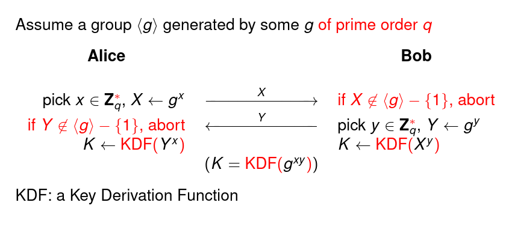
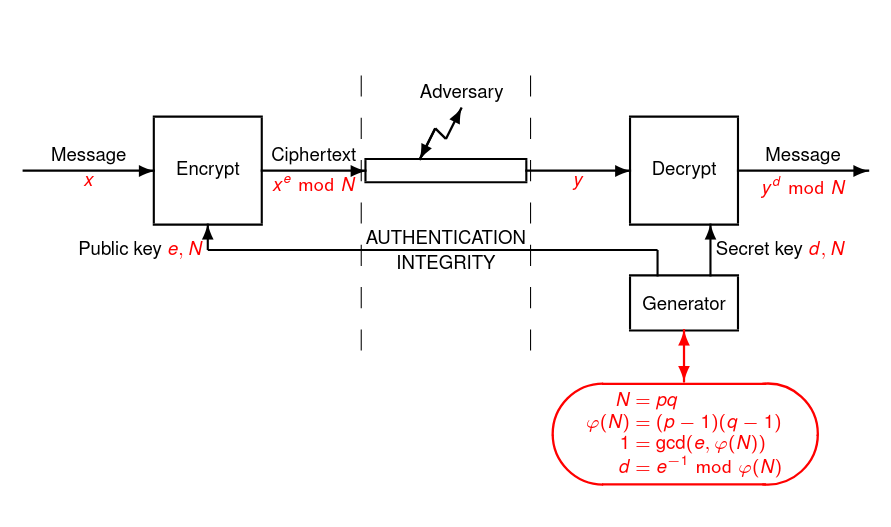

---

**Markdown** version on
[*github*](https://raw.githubusercontent.com/caillouc/Fiche_EPFL/main/Cryptography_and_security/Cryptography_and_security.md)  
Compiled using [*pandoc*](https://pandoc.org/)  
More fiches [*here*](https://github.com/caillouc/Fiche_EPFL)  

# General

* $b \in \mathbb{Z}^*_p$ has a quare root if and only if $b^{\frac{p-1}{2}} \mod
  p = 1$

# Diffie Helman (incomplete)

* We check that $X$ and $Y$ are in $\langle g \rangle$
* Use a KDF to fix bad distribution of $g^{xy}$
* We wheck the lower order $X \neq 1$, $X^2 \neq 1$
* If $n = pq$ then $\mathbb{Z}_n$ ring is isomorphic to $\mathbb{Z}_p
  \times\mathbb{Z}_q$ and $\mathbb{Z}_n^*$ ring is isomorphic to $\mathbb{Z}_p^*
  \times \mathbb{Z}_q^*$

{ width=70% }

# RSA (incomplete)

* Square and multiply algorithm to compute $x^e$ or $x^d$
* Primality test : Verify that a number os prime
* To check if a number is coprime is another one use euclid algorithm
* To compute the inverse of an elem use extended euclid algorithm
* $\varphi(p^\alpha) = (p - 1)p^{\alpha - 1}$
* We can compute square root of $n$ in $\mathcal{O}(\log n)^3$
* Chose $e$ : Pick a random value $e$ until it is coprime with $\varphi(n) =
  (p-1)(q-1)$

{ width=70% }

# Elliptic Curve

* All finite fields have a cardinality of form $p^k$ where $p$ is a prime number
  This prime number $p$ is called the **characteristic** of the field.
* A **binary** field is a field with characteristic equal to $2$
* Over a field $\mathbb{R}$, an elliptic curve with parameters $a$ and $b$
  consists of a special point $\mathcal{O}$ called the *point at infinity* and
  the points $(x, y)$ which are the solutions of the equation $y^2 = x^3 + ax + by$
* Elliptic Curve over a **Prime Field**
  * The **discriminent** is $\Delta = -16(4a^3 + 27b^2)$
  * The curve is **non-singular** iff $\Delta \neq 0$
  * We define the **j-invariant** $j = 1728 \frac{4a^3}{Aa^3 + 27b^2}$, two
    isomorphic curves have the same j-invariant
* Elliptic Curve over a **Binary Field**
  * **Ordinary** curves are defined by two fieds elements denoted $a_2$ and $a_6$
  $$ E_{a_2, a_6}(\mathbb{K}) = \{ \mathcal{O} \} \cup \{(x, y) \in \mathbb{K}^2 ; y^2 + xy = x^3 + a_2 x^2 + a_6 \} $$
  * We define the **j-invariant** $j = \frac{1}{\Delta}$
* Simple factoring method : Pollard's (also called $p-1$ algorithm)
* **Elliptic Curve Method** (ECM) is the best method to find $p$ when it is
  small
* **ECDH** key exchange protocol is tha variant of Diffie-Helman protocol
  working over an elliptic curve group
  * We have two participant $U$ and $V$ using the same subgroup of order $n$
    genrated by some point $G$ over an elliptic curve.
  * They both select their secret key $d_U, d_V \in \mathbb{Z}_n^*$
  * They compute their public key $Q_U = d_U.G$ and $Q_V = d_V.G$ which are
    point and exchange them.
  * Then, they both check that the received publoc key is actually a point of
    the curve which is generated by $G$, different from the point at infinity,
    and that its order is a factor of $n$.
  * They both compute the a point $P$, either by $P = d_U.Q_V$ or by $P = d_V.Q_U$
  * They take the first coordinate $x_p$ of $P$ and convert it into a byte
    string $Z$
  * Finally they compute $K=KDF(Z)$

# Symmetric Encryption

## Block cypher

* **Block cyphers** encrypt/decrypt data by *blocks* of fixed length (typically
  64 or 128 bits)
* **DES** : Blocks of $64$ bits with a key of $56$ effective bits (actually the
  key has $64$ bits but on bit per byte is used for the checksum)
  * Internally the $56$ bits key is expended into a number of $16$ $48$ bits
    subkeys
  * The encryption goes through $16$ rounds each of which uses on subkey as a
    round key
  * The round follows the **Feistel Scheme** :
    * The block is split into two halves
    * The right half goes through a round function with the round key
    * The output of this round function is XORed to the left half
    * The two halves are then exchanged before the next round starts
    * In the last round the exchange of halves if omitted
    * The *round function* is invertible
    * The inverse transform is actually a another Feistel scheme with the round
      key in reverse order
  * They are many know attack against DES
* Since $56$ bits for a secret key are considered as too short, people
  considered triple encryption. This is **tripe-DES** standard
  * There are two variant :
    * Triple DES with two keys : $K_1 = K_2$
    * Triple DES with three keys
    $$ 3DES_{K_1, K_2, K_3}(X) = DES_{K_3}(DES^{-1}_{K_2}(DES_{K_1}(X))) $$
  * A block cypher should be secure against **key recovery** and **decrytion
    attack**
* **AES** (Advanced Encryption Standard) it encrypts blocks of $128$ bits using
  keys of $128$, $192$, $256$ bits.
  * It structure consists of a keylenght-dependent number of rounds ($10$, $12$,
    or $14$ rounds) in which a round key is used
  * In AES, a message block and a *round key* are represented as a $4 \times 4$
    matrix
  * Each byte actually represents an element of $GF(Z^8)$ with reference
    polynomial $P(X) = X^8 + X^4 + X^3 + X + 1$ I.e, a bitstring $a_7 \dots a_0$
    represents the polynomial $a = a_7 X^7 + \dots + a_1 X + a_0$ and additons
    and multiplications are done modulo $2$ and modulo $P(X)$
  * The addition in the field corresponds to the XOR of the bitstrings
  * To multiply $a$ by $0x02$ we just shift the byte $a$ by one bit to the left
    and XOR the $0x1b$ if there is a carry bit
  * To multiply $a$ by $0x03$ we can multiply by $0x01$ and by $0x02$ and add
    (XOR) the twos results
  * In AES we only need to multiply by $0x01$, $0x02$ and $0x03$
  * Each round consists of four types of successice transform
    * *AddRoundKey* which adds (XOR) the round key to the block
    * *SubBytes* which substities every byte $a$ by the byte $S(a)$, following a
      table $S$ (called the *S-box*)
    * *ShiftRows* which consists of a circular shift of every row of the block
      by a variable number of positions
    * *MixColumns* which consists of mutlipying all columns of the block to the
      left by a prefined matrix $M$
   * To decrypt we just have to invert all subroutine processes
* If we want to encrypt a message which consists of several blocks, we need to
  plug the block cipher into a **mode of operation**
  * **Electric Codebook** (ECB) mode consists of encrypting each blokc
    separatly, using the block cipher
    * This is however insecure for most of applications : indeed in the messages
      that applications want to encrypt, it is very likely that some blocks of
      data repeat
  * **Cipher Block chaining** (CBC) mode, each block of plaintext is XORed to
    the previous ciphertext block before being encrypted. The first plaintext in
    XORed to an initial vetor IV. There is three ways to use IV:
    * Use a constant, publicly know IV
    * Use a secret IV (so the secret key becomes (IV, K))
    * Use a fresh random IV for every messages $x$ and add it as a part of the
      ciphertext
  * The **Output Feedback** (OFB) mode uses an IV. It consists of defining the
    sequence $k_i = ENC_K(k_{i-1}), i = 2, \dots$ and $k_1 = ENC_K(IV)$. It
    requires the IV to be unique, due to the properties of the one-time-pad, we
    then call the IV a nonce
  * The **Cipher Feedback** (CFB) mode is defined by
    $y_i = x_i \oplus ENC_K(y_{i-1}), i = 2$, and $y_1 = x_1 \oplus ENC_K(IV)$
    The nonce IV options are the same as for OFB mode. The CFB works even if the
    last plaintext block is incomplete
  * The **Counter** (CTR) mode ises a none $t_i$ for every block. The encryption
    of $x_i$ is $y_i = x_i \oplus ENC_K(t_i)$. The nonce is based on a counter.
    The CTR mode works even if the last plaintext is incomplete

## Stream Ciphers

* **Strem ciphers** are used to encrypt strems of data on the fly. The main
  principle is that we use one-time-pad with a pseudorandom key-stream defined
  from a secret key and a nonce
* **RC4** generates a key-stream of bytes from a secret key (to be used only
  once) which is a sequence of bytes of total length between $40$ bits and $256$
  bits
  * They are many know weakness in RC4
* **A5/1** uses a $64$ bits secret and a $22$ bit counter, used a nonce. The key
  and the counter are first transform into an initial state. Then, an automaton
  base on asynchronous linear feedback shift registers generates a key stream of
  bits
  * They are many known attack against A5/1

## Bruteforce Inversion Algorithms

* Let $\mathcal{K}$ be a set of given size $N$. Consider the **random key
  guessing game** during which a challenge selects a key $K \in \mathcal{K}$ at
  random, then an adversaty makes guesses for the value of $K$ until it is
  correct
  * The average case complexity is $\frac{N + 1}{N}$
  * If the distribution is arbitrary and unknown, the best strategy is to
    enumerate the value of $\mathcal{K}$ in a random order
  * If the distribution is known, wa can enumerate the value of $\mathcal{K}$ by
    decreasing order of likelihodd and obtain the obtimal complexity which is
    called the **guesswork entropy**
  * If the adversary is given a clue which we call a *witness w*. Then the
    optimal strategies is to enumerate all $k \in \mathcal{K}$ by decreasing
    order of $P(K = k \mid w)$
* A **dictionary attack** consists of preparing a complete table for the
  inverse function. The attack then works with constant complexity but requires
  a memory of $\mathcal{O}(N)$, and a preprocessign of $\mathcal{O}(N)$ as well
  * With an incomplete dictionary of size $D$, the precomputation time is
    $\mathcal{O}(D)$, the complexity is $\mathcal{O}(D)$ the time complexity of
    the attak phase is $\mathcal{O}(1)$, but the probability of success in
    $\frac{D}{N}$ and not $1$ anymore
  * The attack can be enriched by considering a multi-target version : Instead
    of targeting a single $K$, the goal is to recover at leat one $K_1, \dots,
    K_T$ of $T$ targets. In that case the dictionay attack needs a
    precomputation time of $\mathcal{O}(D)$, a memory complexity of
    $\mathcal{O}(D)$ a time complexite of the attack of $\mathcal{O}(T)$, but a
    propability of sucess of $1 - e^{-\frac{DT}{N}}$
* **Meet in the middle attack on double encryption**. Consider a double
  encryption scheme :
  $$ Enc_{K_1, K_2}(x) = ENC_{K_2}(ENC_{K_1}(x)) $$
  where the keys belong to a set of $\mathcal{K}$ of size $N$. We assume a known
  plaintext scenario where a pair $(x, z)$ with $z = ENC_{K_1, K_2}(x)$ is known
  * The **meet in the middle** algorithm consists of
    * Preparing a dictionary of $(ENC_{k_1}(x), k_1)$ pairs
    * Makes an exhaustive search on $k_2$ to compute $y = ENC_{k_2}^{-1}(z)$
    * Looks for $(y, k_1)$ in the dictionary and print $(k_1, k_2)$ if there is
      such an entry
    * Complexity is $\mathcal{O}(N)$ both in time and space

# Integrity and Authentication

* In a **Commitment scheme**, there are two participants, the sender and the
  receiver, running a protocol in two phases: The commitment phase and the
  opening phase. The sender wants to commit on message $X$ without revealing it.
  * The sender picks some random $r$ and computes $(c, k) = Commit(X, r)$
  * He then reveals $c$ to the receiver
  * In the opening phase, the sender reveals $k$ and the receiver can compute
    $Open(c, k) = X$
  * The correctness requirement implies that $Open(Commit(X, r)) = X$ for any
    $X$ and $r$
  * The commitment must be **hiding** : The receiver shall not retreive any
    information about $X$ during the commitment phase (This is similar to
    encryption)
  * Compared to encryption there is a second security property which is required
    : The commitment must be **binding** : the sender shall not be able to
    construct $c$, $k$, $k'$ such that $Open(c, k) \neq Open(c, k')$

* **Pseudorandom generator** is typically an automaton initialized with a seed,
  with a seed, which updates its state and outputs a number ar everygeneration.
  Cryptographic pseudorandom generators must be such that the generatated
  sequence of random numbers
* **Key derivation function** (KDF) typically maps some random value with
  imperfect distribution into a symmetric key which has a distribution close to
  uniform
* A **hash** function maps a bitstring of arbitrary length to a bitstring of
  fixed length. There are three main uses of hash functions :
  * Domain expansion
  * Commitment
  * Pseudorandom generation
* We often require hash function to be **collision-resistant**
  * It must be impossible impossible to find $x$ and $y$ such that $H(x) = H(y)$
    For this reason $H(x)$ is often called the *digest* or *fingerprint* of
    *hash* of $x$
* A **Message Authentication Codes** (MAC) typically appends a *tag* to message.
  This tag is computed based on a secret key and the message. The message is
  authenticated if it comes with a correct tab, based on the secret key
* **HMAC** is one of the popular MAC algorithm
  $$HMAC_K(X) = trunc(H((K \oplus opad) \mathbin\Vert H ((K \oplus ipad)
  \mathbin\Vert X))) $$
  where $opad$ and $ipad$ are constants defined by the standard
* **CBCMAC** is another popular construction based on a block cipher. The tab of
  a message is the last ciphertext block of the CBC encryption of the message
  The algorithm is secured in two case :
  * The application males sure that all messages have exactly the same length
  * The tag is only available to the adversary in some encrypted form
* **PMAC** is a block-cipher based construction. It is also prven secure if
  block cipher is a pseudorandom permutation
* **VCMAC** is an analog to the vernam cipher for authenticated messages which
  provides unconditional security. To authenticate a message $X$, we essentially
  encrypt a value $h_K(X)$ using the vernam cipher, where $h$ is an
  $\epsilon$-XOR-universal hash function
* **Authentication modes of operation**
  * In *CCM mode*, the message is concatenated with its CBCMAC, then ecnrypted
    in CTR mode
  * In the *GCM mode* the message is concatenated with its universal hash, then
    encryted in CTR mode
* A **universal hash function** $GHASH_H(X_1, \dots, X_m)$ for a sequence of
  blocks $X_1, \dots, X_m$ and a key $H$ which is nother block. EAch block is
  taken as ane element of $GF(2^{128})$ and we define
  $$ GHASH_H(X_1, \dots, X_M) = X_1 H^m + \dots + X_m H $$
  in $GF(2^{128})$
* Let $\theta > 0$ be a real number. If we pick $n$ independant and uniformly
  distributed elements $X_1, \dots, X_n$ in a set of cardinality $N$, if $n =
  o(N)$ as $N$ goes to infinity then the probability that at least two elements
  are equal is
  $$ P[\exists i < j X_i = X_j] = 1 - \frac{N!}{(N - n)!N^n} = 1 -
  e^{-\frac{n^2}{2N} + o(1)} $$
* If we repeatedly pick samples until we find a collision, the expected number
  of samples before we stop with a collision is $\sqrt{\frac{\pi}{2}} \times
  \sqrt{N}$
* There exist also constant-memory algorithms to find collisions with complexity
  $\mathcal{O}(\sqrt{N})$. For instance the Floyd cycle algorithm can be used.
* Symmetric encryption must face the generic attacks of complexity $2^n$, when
  $n$ is the bitlength of the key. We take this as a reference for a security :
  a symmectric encryption scheme is secure if this is the best attack we can
  mount on it. So the keylenght is the security parameters.In general we say
  that the bitlength-equivalent security is $n$ if the best attack needs $2^n$
  operations

# Public Key Cryptography

* In **public key cryptography** we have two probabilistic algorithms $Gen$ and
  $Enc$ and one deterministic one $Dec$. $Gen$ generates a pair $(pk, sk)$ where
  $pk$ is called the **public key** and $sk$ the **secret key**, and such that
  for any $X$ in the domain, we always have $Dec_{sk}(Enc_{pk})) = X$
* In a key agreement protocol (also called **key exchange** or **key
  establishment**), there are two probabilistic interactive algorithms with no
  input which generate the same output (the key) when interacting with each
  other. It should be such that this output is secret even though the messages
  between the twos algorithm are public
* In **static mode** the public keys are long term values
* In **ephemeral mode** the public keys are freshly generated for each sessions
  of the protocol
  * It adds the property of *forward secrecy* : If the any long term-term is
    corrupted in the far future, this cannot compromise the secrety of
    encryptions which are done using the output of the output of the key
    exchange
* In **semi-static mode**, one key is fresh and the other is a long term one
* We say that a digital scheme has the property of **message recovery** if from
  $\sigma = Sig_{sk}(X)$, we can extract $X$ by $Ver_{pk}(\sigma)$. In many
  concrete schemes, the output of $Sig_{pk}(X)$ is of the form $X \mathbin\Vert
  \sigma$ where $\sigma$ is called the *signature*. In that case, $Ver_{pk}(X
  \mathbin\Vert \sigma)$ is aborting if $\sigma$ is an invalid signature of $X$
* A popular way to construct a signature scheme (without message recovery) from
  a traddoor permutation is by using a hash function. In this construction, we
  have $Sig(X) = InvPerm(h(X))$
* Lot of stuff arround signature ... not done yet ...
* So far the best way to **break RSA is to factor $N$**. The keys must be chosen
  such that factoring $N$ is infeasible. We just have to adjust the length of
  $p$ and $q$ and avoid some known forms of weak moduli
* For scheme such as **Diffe Hellman, ElGamal**, the best way is to solve the
  discrete algorithm problem. Either we work in a subgroup of $\mathbb{Z}^*_p$
  given a prime $p$
* The following security parameters propose equivalent security
  * Symmetric encryption with a $82$-bit key
  * RSA with a $1613$-bit modulus
  * Discrete logarithm with a subgroup of order $q$ of $\mathbb{Z}^*_p$, where
    $p$ has $1613$ bits and $q$ has $145$ bits
  * An elliptic curve over a field whose cardinality has $A54$ bits
  * A hash function with digest length of $163$ bits
* A **public key cryptography** is a tuple $(Gen, \mathcal{M}, Enc, Dec)$ with a
  plaintext domain $\mathbb{M} \subseteq \{0, 1\}^*$ and three effecient
  algorithms $Gen$, $Enc$, and $Dec$. The algorithm $Dec$ is deterministic out
  output either something in $\mathcal{M}$ or an error. It is such that
  $$ \forall X \in \mathcal{M} \quad P[Dec(sk, Enc(pk, X)) = X] = 1 $$
  where $(pk, sk)$ is generated from running $Gen$
* **Digital signature scheme** is a tuple $(Gen, \mathcal{D}, Sig, Ver)$ with a
  message domain $\mathcal{D} \subseteq \{0, 1\}^*$ and three effecient
  algorithms $Gen$, $Sig$, and $Ver$. The algorithm $Ver$ is deterministic and
  outputs $0$ (*reject*) or $1$ (*accept*). It is such that
  $$ \forall X \in \mathcal{D} \quad P[Ver(pk, X, Sig(sk, K)) = 1] = 1 $$
  where $(pk, sk)$ is generated form running $Gen$
* A digital signatue scheme $(Gen, \mathcal{D}, Sig, Ver)$ is **$(q, t,
  \epsilon)$-secure against axistential forgery under chosen message attacks**
  if for any probabilistic algorithm $A$ limited to a time complexity $t$ and
  $q$ queries, the advantage is bounded by $\epsilon$

# Trust Establishment

* **Password acces control** To avoid leakage from the database we can avoid
  storing the password by saving only a hash of it. To secure against
  multi-target attaks and time-memory tradeoffs, we can add a salt which has to
  be stored as well. So ht database contains $(ID, salt, H(ID \mathbin\Vert salt
  \mathbin\Vert w))$ triplets, where $w$ is the user password
* **Challenge/response access control** consists of sending a challenge $c$ to
  the client to which he must answer by some $r = f_K(c)$ where $K$ is his key
  and $f$ is a pseudorandom function
* **One time password (OTP)** Essentially we have a long list of passwords and
  each password can only be used only once. Typically, the sequence is generated
  form a secret seed backward : from the last to be sued to the first one. Each
  password is the image of the next password by a one way function. So the
  server only stores the last used password and checks that the new one hashes
  onto the stored one
* **Strong authentication** is the techniques usign several factors. We can use
  factors based on *what we know*, on *what we process*, or on *what we are*
* The main security properties that we must obtain for **secure communication**
  are:
  * *Confidentiality* : Only the legitimate receiver can retrieve the messge
    * Enforce by symmetric encryption
  * *Authentication* : Only the legitimate sender can create a new message
    * Enforce using a MAC
  * *Integrity* : the received message must be equal to the sent one
    * Enforce using a hash function or with a MAC
