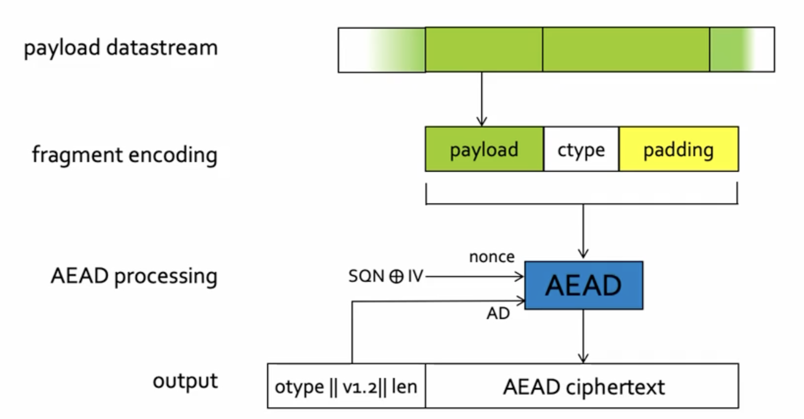

---

**Markdown** version on
[*github*](https://github.com/caillouc/Fiche_EPFL/blob/main/Network_Security/Network_Security.md?plain=1)  
Compiled using [*pandoc*](https://pandoc.org/) and [*`gpdf` script*](https://github.com/caillouc/dotfile/blob/linux/gpdf.sh)  

# TLS

## General

  * **TLS**: **T**ransport **L**ayer **S**ecurity
  * It's goal is to provide a **secure channel between two peers**
  * **Entity authentication**
    * **Server** side of the channel is *always authenticated*
    * **Client** side is *optionally authenticated*
    * Via **Assymetric crypto** or a symmetric *pre-shared key*
  * **Confidentiality**
    * *Data* send over the channel is *only visible to the endpoints*
    * TLS does *not hide the length* of the data it transmits (but allows padding)
  * **Integrity**
    * *Data* sent over the channel *cannot be modified* without detection
    * Integrity guarantees also cover reordering, insertion, deletion of data
  * **Efficiency**
    * Attempt to minimise crypto overhead
    * Minimal use of public key techniques; maximal use of symmetric key
      techniques
    * Minimise number of communication round trips before secure channel can be
      used
  * **Flexibility**
    * Protocol supports flexible choices of algorithms and authentication
  * **Self negociation**
    * The choice is done in hand, i.e. as part of the protocol itself  
    * The is done through the version negociation and cipher suite negociation
      process: the client offers, server selects
  * **Protection of negocation**
    * Aim to prevent MITM attacker from performing version and cipher suite
      downgrade attacks
    * So the cryptography used in the protocol should also protect the hsoice of
      cryptography made
  * **TLS** aims for security in the face of *attacker who has complete control of
    the network*
  * Only requirement from underlying transport: reliable, in order data-stream
  * **Handshake protocol**: Authentication, negociation and key agreement
  * **Record protocol**: Use those keys to provide confidentiality and integrity
  * **TLS 1.3** design process goals
    * *Clean up*: get rid ot flawed and unused crypto & features
    * *Improve latency* : for main handshake and repeated connections (while
      maintaining security)
    * *Improve privacy*: hide as much of the handshake as possible
    * *Continuity*: maintain interoperability with previous versions and support
      exisiting important use cases
    * *Security Assurance (added later)*: have supporting analyses for changes
* TLS uses mostrly 'boring' cryptography yet is a very complex protocol suite
* Some protocol design errors were made, but not too many
* Legacy support for EXPORT cipher suites and liong tial of old versions opened
  up seious vulnerabilities
* Lack of formal state-machine description, lack of API specification, and sheer
  complexity of specifications have let to many serious implementations errors
* Poor algorithm choices in the Record Protocol should have been retired
  more aggressively
* Most of this had been fixed in TLS 1.3
* TLS 1.3 was developed hand-in-hand with formal security analysis
* The design changed many times, often changes driven by security concerns
  identified through the analysis
* Cryptography has evolved significantly in TLS
* The largest shift was from RSA key transport to elliptic curve Diffie-Hellman,
  and from CBC/RC4 to AES-GCM
* A second shift now underway is to move to using newer elliptic curves,
  allowing greater and better implementation security
* A third shift is the move away from SHA1 in certs
* A future shift is being considered to incorporate post-quantum algorithm
* But Implementation vulnerabilities are bound to continue to be discovered

## Record Protocol

* The TLS Record Protocol provides a **stream oriented** API for applications
  making use of it
  * Hence TLS may fragment into smaller units or coalesce into larger units
    any data supplied by the calling application
  * Protocol data units in TLS are called **records**
  * So each record is a fragment from a **data stream**
* Cryptographic protectionin the TLS Record Protocol
  * Data origin authentication & integrity for records using a MAC
  * Confidentiality for records using a symmetric encryption algorithm
  * Prevention of replay, reordering, deletion of records using per record
    sequence number protected by the MAC
  * Encryption and MAC provided simultaneously by use of AEAD in TLS 1.3
  * Prevention of reflection attack by key separation
* *Datastream* is divided in different **payload**
* Each *payload* in concanated with a bit (**ctype**) and an optional
  **padding**; this give a **fragment**
* This is then given to **AEAD** encryption
  * Needs in input a *nonce*, some *associated data* (AD) (otype, v1.2, and
    len field) and a plaintext
* **ctype field**
  * Single byte representing content type - indicates wheter contetn is
    handshake message, alert message or application data
  * AEAD-encryption inside record; header contains dummy value otype to limit
    traffic analysis
* **padding**
  * Optional features that can be used ot hide true length of fragments
  * Not needed for encryption
  * Sequence of 0x00 bytes afer non-0x00 content type field
  * Removed after integrity check, so no padding oracle issues arise (Time
    side channel attack to recover lenght on plaintext)
* **AEAD nonce**
  * $Nonce = SQN \bigoplus IV$
  * Constructed from 64 bits sequence number ($SQN$)
  * $SQN$ is incremented for each record sent on a connection
  * $SQN$ is masked by XOR with $IV$ field
  * $IV$ is a fixed (per TLS connection) pseudorandom value deirved from
    secrets in TLS handshake protocol
  * $IV$ masking ensures nonce sequence is 'unique' per connection, good for
    security in multi-connection setting
* **Record header**
  * Contains dummy field, legacy version field, length of AEAD ciphertext
  * Version field is always securely negociated during handshake
  * $SQN$ is not included in header, but is maintained as a counter at each
    end of the connection (send and receive)

## Handshake Protocol

* TLS 1.3: **full handshake in 1 RTT**
  * Achieved via feature reduction: we always do (EC)DHE in one of a shortlist
    of groups
  * Client includes DH shares in its first message, along with `Clienthello`,
    anticipating groups that server will accept
  * Server respons with single DH share in its `ServerKeyShare` response
  * If this works, a forward-secure key is established after 1 round trip
  * If server dos not like DH groups offered by client, it sends a
    `HelloRetryRequest` and a group description back to client
    * In this case, the handshake will be 2 round trips
* **0-RTT handshake** when resuming a previously established connection
  * Client + server keep shared state enabling them to derive a PSK (pre-shared
    key)
  * Client derives an 'early data' emcryption key from the PSK and can use it to
    include encrypted application data along with its first handshake message
  * *sacrifices* certain securitty properties
* Because of reliance oc Ephemeral DS key exchange, TLS 1.3 handshake is
  **forward secure**
* This means: compromise of all session keys, DH values and signing keys has no
  impact on the security of earlier sessions
* Use of ephemeral DH also means: if a server's long term (signing) key is
  compromised, then an attacker cannot passively decrypt future sessions
* Compare to RSA key transport option in TLS 1.2 and earlier: past and future
  passive interception using compromised server RSA private key

# Public Key Infrastructure (PKI)

* In symmetric cryptography, main challenge is key distribution as keys need to
  be distributed via **confidential and authentic** channels
* In public-key system, main challenge is key authentication (i.e., which key
  belongs to who) as keys need to be distributed via **authentic channel**
* **Public-key infrastructure (PKIs)** provide a way to validate public keys
* **CA**: certificate Authority
* A **public-key certificate** (or simply **certificate**) is signed and dinds a
  name to a public key
* **Trust anchor, trust root**: self-signed certificates of public keys that are
  allowed to sign other certificate
* **X.509** strandard format of digital certificate
* **Root of trust** is used to establish trust in other entities
* *Cryptography operations enable transfer of trust from one entity to another*
* Trust roots do not scale to the world
  * *Monopoly model*: single root of trust
    * Problem: world cannot agree on who controls root of trust
  * Obligarchy model: numerous roots of trust
    * Problems: Weakest link security: single compromised enables
      man-in-the-niddle attack; not trusting some trust roots results in
      unverifiable entities
* **Let's Encrypt**
  * Goal: provide free certificate based on automated domain validation,
    issurance, and renewal
  * Based on ACME; Automated Certificate Managment Environment
* **Certificate Revocation**
  * Certificate revocation is a mechanism to invalidate certificates
    * After a private key is disclosed 
    * Trusted employee / administrator leaves corporation
    * Certificate expiration time is usually chosen too long
  * CA periodically publishes Certificate Revocation List (CRL)
    * Delta CRLs only contains changes
    * What to do if we miss CRL update? 
  * What is general problem with revocation
    * CAP theorem (Consistency, Availability, tolerance to partition):
      impossible to achieve all 3, must select one to sacrifice
* **DANE** 
  * DNS-Based Authentication of Named Entities 
  * Goal: Authenticate TLS servers without a certificate authority
  * Idea: use DNSSEC to bind certificate to names
* **Certificate Transparency**
  * Will make all public end-entity TLS certificate public knowledge, and will
    hold CAs publicaly accountable for all certificates they issue
  * And it will do so withou introducing another trusted third party
  * A CT log is an append-only list of certificate
  * The log server verifies the certificate chain
  * Periodically append all new certificates to the append-only log and sign
    that list
  * Publish all updates of the signed list of certificates to the world
  * A CT log is not a "Super CA"
    * The log does not testify the goodness of certificates; it merely notes
      their presence
    * The log is public: everyone can inspect all the certificates
    * The log is untrusted: since the log is signed, the face that everyone sees
      the same list of certificate is cryptographically verifiable
  * How CT improves security
    * Browser would require SCT for opening connection
    * Browser contacts log server to ensure that certificate is listed in the
      log
  * Consequence
    * Attack certificate would have to be listed in public log
    * Attacks become publicly known
  * Advantages
    * CT is fully operational today
    * No change to domain's web server required
  * Disadvantages
    * MitM attacks can still proceed
    * Browser still needs to contact Log eventually to verify that certificate
      is listed in log
    * Current CT does not support revocation
    * Malicious Log server can add bogous certificate
    * Management of list of trusted log server can introduce a kill switch
* **Summary**
  * Cannot tolerate additional latency of contacting additional server during
    SSL/TLS handshake
  * A key has to be immediately usable and verifiable after initial registration
  * Users shouldn't be bothered in the decision process if certificate is
    legitimate
  * Need to cover entire certificate life cycle, including revocation, handing
    stolen and lost certificate
  * Secure crypto and secure protocols are insufficient
    * Numerous failure possibilities
    * User interface security and certificate management are critically
      important
  * The entity who controls the root keys, controls all authentication and
    verification operations
  * PKI and revocation can result in a powerfull 'kill switch', which can enable
    shouting down part of internet
    * Sovereign PKI continues to be an important research challenge

# Virtual Private Networks (VPNs)

* VPN creates a **Secure channel** between two networks over an **untrusted
  network** 
  * **Set-up phase**: the gateways (tunnel endpoints) *authenticate* each other and
    *set up keys* 
  * **Tuneling phase**:
    * Packets are encapsulated at the first gateway
    * ... and decapsulated at the second
* Simalar security properties as the TLS record protocol
  * Authentication of the source (handshake) data integrity (MACs)
  * Secrecy (symmetric encryption)
  * Replay suppression (sequence numbers)
* VPN setup 1: secure connection between two physically separared networks (site
  to site)
  * Replace private physical networks and leased lines
    * Even for leased lines, encryption may be desirable
* VPN setup 2: secure connection of a remote host to company/university network
  (host to site)
  * Remote host can access resources in private network
    * Private IP addresses can be accessed without port forwarding
    * Services do not need to be exposed to the Internet
  * First gateway located at the host
    * All traffic between host and private network is secure
* VPN setup 3: VPN as a 'secure' proxy (to get a different IP address)
  * Circumvent censorship
  * Avoid trackigng by your ISP or in a public Wi-Fi network
  * Hide your IP address from websites
  * Spoof your location
  * Access restricted content
  * Downloads torrents  (only legal ones of course)
* Inportant: VPN provider has access to metadata of all traffic
* $PVN /neq anonimity$
* VPNs provide some limited anonimity properties
  * Local network and ISP only see that you send traffic through some VPN
    * They do not see which websites you access
  * Web servers do not see you real IP address
    * Of course, if you use cookies or log in, anonimity is lost
* VPN server can monitor and record all traffic
* Why do we need VPNs when we have TLS?
  * VPNs protect *all* traffic: *blanket* security
    * DNS requests
    * Access to services that do not support TLs
  * VPNs can give some access to services in private networks or behind
    firewalls
* Why do we need TLS when we have VPNs?
  * Data is only secure in the tunnel: no security outside of it
  * VPN server can see all uncrypted traffic $\rightarrow$ TLS still necessary
  * With a VPN it is not possible to authenticate the webserver, only the tunnel
    endpoint
* VPNs can *negatively impact performance*
  * Additional cryptographic operations
  * Potential detours
  * Limited bandwidth at VPN server
* Generally, VPNSs do not provide higher availability
  * No build in defense against DoD or routing attack
* VPNs *can defend against targeted packet filtering*
  * Routers can recognize VPN packets but not content
  * Would need to drop all VPN packets
* VPNs themselves can become targets for DoS attacks
* VPN vs **VLAN** (virtual local area network)
  * VPN (securely) *connect/combine* two different networks
    * One virtual network over multiple physical networks
  * VLAN: set up multiple *isolated virtual networks* on a single physical
    infrastructure
    * Virtual networks are identified by tags, which are added to Ethernet
      frames
    * Often used in cloud-computing environments for isolating communication
      betweens VMs
* **Authentication mechanism**
  * Pre-shared key (PSK)
  * Public keys and certificates
  * Client: username/password 
* **Tunneling mechanism** (tunnel protocol)
  * Custom protocols (IPsec)
  * Tunnel over TLS (SSTP)
* **Layer of connected networks** (inner protocol)
  * Layer 3 (Network Layer)
  * Layer 2 (Link Layer)
* **Implementation**
  * User space
  * Kernel module
  * Hardware
* VPN creates **virtual network adapter**
* Can be used like any other network adapter
* VPN interface can be used to all traffic or only selectively
* **IPsec** is a very large and complicated protocol
  * A typical IPsec session
    * Set up a security associaction (SA) via IKE
    * Encapsulate packets and tunnel them between SA endpoints
* **Wireguard**
  * No cryptographic agility
    * Only use state-of-the-art primitives 
    * Simplify negociation and remove insecure promitives
  * Very simple configuration - similar to `autorized_keys` file in ssh
  * Very small codebase, minimal attack surface, formally verifiable
  * handshake follows the Noise Protocol Framework
    * Built exclusively on (elliptic curve) Diffie-Hellman exchanges
  * Each peer has a *static key* pair
  * Each peer creates *ephemeral key* pair
  * Derive symmetric keys from four Diffie helman combinations
  * 1-RTT  handshake
  * Wireguard does not store state before authentication and does not send
    responses to unauthenticated packets
    * Invisible to attackers
    * Prevent state-exhaustion attacks
  * Initial message contains a timestamp to prevent replay attacks
* VPNs create **secure channels** on the network or link layer
* VPNs and end-to-end security (TLS) **complement each other**
* Many different VPN protocols and applications
  * **IPsec has** a long history and *numerous configuration options*
    * Very versatile but difficult to set up
  * **WireGuard** is a new VPN protocol with a focus on simplicity
    * Very few configuration parameters, no cryptographic agility
    * Simple to set up 
    * Small codebase $\rightarrow$ small attack surface

# Anonymous-Communication Systems

* IP address leak metadata information
  * Who talks to whom, at what time, for how long, how frequently
  * NSA can log connection metadata, and later incriminate Snowden
* **Anonimity** and related concepts is tricky
  * Anonimity is not a property of individual messages or flows; *You cannot be
    anonymous on your own*
* **Sender anonimity**
  * Adversary knows/is receiver
  * Adversary may learn message
  * Sender is unknown
  * **Sender anonimity set**
    * Set of all senders/individuals indistinguishable from real sender
    * Can be used as a rough metric
    * Small set $\implies$ little anonimity
  * **Return address** Tolen provided by the sender
* **Receiver anonimity**
  * Adversary knows/is sender
  * Adversary may choose message
  * Receiver is unknow
  * How does destination receive traffic
    * **Onion service** (pseudonym known)
* **Unlinkability**
  * Adversary knows senders
  * Adversary knows receivers
  * Link between senders and receivers is unknown
  * Multiple users need to communicate at the same time 
* **Unobservability**
  * Adersary cannot tell whether any communication is taking place
  * Always send traffic
* Plausible deniability
  * Adersary cannot prove that any particular individual was responsible for a
    message
* **Threat models**
  * There are various types of adversaries that can be considered
  * Degree of control: *local* or *global*
  * Type of contorl: *network* or *compromised infrastructure*
  * Tyoe of behavior: *passive* or *active*
* User multiple proxies to avoit single point of failure (*cascade*)
  * Each proxy only sees addresses of two neighbors
  * Should work if the message addresse traverses at least one honest proxy
* Message and forwarding information is encrypted multiple times (onion)
  * All keys are necessary to decrypt
* **Mix-nets**
  * Intented for sending anonymous emails
    * Latency is not a big concern
    * No connection setup, only individual messages
  * Built on asymmetric cryptography
  * Each mix has a public/private key pair
  * Public keys and addresses are known to the sender
  * Problem: network attacker can observe in and outgoing messages
    * Each proxy should perform **batching**: Collect several messages before
      forwarding
    * Additionally, the proxies should change the order of (**mixing**) the
      messages, this is called **threshold mix**
    * Important: messages need to be padded to a *fixed length* to make them
      indistinguishable
  * To achive full Unobservability, user **cover traffic**
  * How to send reply?
    * Idea: Inlcudes an *untraceable* path return address in its message
  * Problems of mix-nets: high latency dut to batching and mixing; overhead due
    to asymmetric cryptography
* **Forward Security**: if long term keys are compromised, anonimity of
  previously establisged circuits is preserved
* **Circuit-based anonimity networks** (onion routing)
  * *Layered encryption*, no batching and mixing, no cover traffic
  * Flow-based: establish a *virtual circuit* (keys) once per flow, reuse it for
    all packets in the flow using only *symmetric key crypto*
  * The *nodes* are called **relays**
  * The virtual circuit is also called **tunnel**
  * **Circuit setup**
    * Initially, sendre knows long-term public keys or relays
    * The sender negociates shared keys with all relays on the path; this
      require (expensive) *asymmetric cryptography*
    * The relays store the necessary state
  * **Direct circuit setup**: Establish state on relays by using a normal packet
    as for mixes
    * Message for each node contains address of next node and ephemeral
      Diffie-Helman share
    * Each node replies with its own ephemeral Diffie-Helman share
    * Ecnryption of setup packet uses long-term Diffie-Helman share
    * Relatively fast
    * Does not provide (immediate) forward security for long between
      communication patners
  * **Telescopic circuit setup**
    * Keys are negociated one relay at a time
    * The circuit is 'extended' by one hop at the tine
    * The setup is slower but it offers immediate forward security
  * **Data forwarding**
    * Packets for one or more flows are forwarded along the circuit
    * Only *symmetric cryptography* is used (AES)
  * **Circuit tear-down**
    * The circuit is destroyed to free state on relays or to prevent attacks
    * Can be both by sender and by intermediate ralays
    * Circuits have a limited lifetime, so they will eventually be destroyed

| . | Mix-net | Onion routing |
| --- | --- | --- |
| Forwarding system | Messag-based | Circuit based |
| Layered encryption | yes (asymmetric) | yes (symmetric) |
| Mixing and batching | yes | no |
| Cover traffic | yes (optional) | no |
| Forward Security | no | yes (Telescopic setup) |
| Latency | high | low/medium |

* **Tor**
  * Most widely used anonymous-communicatioin system
  * Circuits established over *3 relays*
  * *Telescopic setup*
  * *Per-hop TCP*, established on the fly
    * Avoid TCP stack fingerprints
  * *Per-hop TLS* (except on the last hop)
    * Multiple circuits over the same TLS connection
    * End to end HTPPS is possible
  * Exit policies (exit can restrict the destinations they connect to)
  * **Onion services**
    * Provide receiver anonimity
    * Use `.onion` URL (not in DNS)
    * How can we authenticate the onion service if that wants to be anonymous?
      The hash of Bob's public key is the identifier of his hiddent service
    * Bod has conenctions to a set of special ralays called *introduction
      points* (IP)
    * To communicate, Alice connects to an IP and suggest a *rendez vous*
    * Bob can connect to the *rendezvous* and start the communication
  * **Tor cells**
    * Basic unit is the cell (512 bytes)
    * It contains a circuit ID and ac ommand field (cleartext)
    * Same for cells in both directions
  * A *relay* cell's payload is decrypted and its digest is checked
    * If correct (this means the current relay is the intended recipient) check
      command
    * Otherwise (it is an intermediate node just forwarding the cell): replace
      circuit ID and forward cell along
    * Only exit relays sees unencrypted payload
  * **Directry authorities**
    * How do the clients know what relays there are?
    * *10 directory authorities* running a consensus algorithm
    * The authorities track the state of relays, store their public keys
    * Client software comes with a list of the authorities's key
    * The centralized authorities are an *important weakness* or Tor
    * Every relay periodically reports a signed statement
    * DAs also act as bandwidth authorities: verify bndwidth of nodes
  * Censorship resistance in Tor
    * Relay nodes are publicaly listed and can be blocked
    * The Tor network contains several *bridge relays* (or *bridges*); not
      listed in main Tor directory, downloaded on demand; use to circumvent
      censors which block IP address of Tor delays

# Border Gateway Protocol (BGP) Security

* **Rerouting attacks** issues
  * Not all traffic is encrypted/authenticated: DNS, HTTP
  * Even encryptted traffic leaks timing information
  * Rerouting can cause dropped packages and widespread outages
  * Hard to notice and impossible to solve without ISP cooperation
  * Undermine and invalidate other security protocols (can get a fake
    certificate using acme $\rightarrow$ TLS becomes useless)
* **IP prefeix origination** into BGP
  * Prefix advertised/announced by the AS who owns the prefix
* **IP prefix hijacking**
  * A malicious (or misconfigured) AS announces a prefix it does not own
  * Today, no proper verification in place
* **BGP does not validate the origin of advertisements**
* **BGP Interception**
  * Selectively announcement of hijack prefix only to some neighbors
    * Problem: neighbors may still learn hijacked routes from their peers
  * Use **BGP poisonning**
    * Only some of the neighbors use hijacked route
  * Use BGP communities to ensure the announcement only reaches certain ASes
    * Can tell ans AS not to forward announcement to specific other ASes using
      the 'NoExportSelected' action
  1. Set up an AS and border router or compromise someone else's router
  2. Configure router to originate the target (sub-)prefix
  3. Get other ASes to accept the wrong route
* **BGP does not validate the content of advertisements**
* ASes can modify the BGP path
  * *Remove ASes from the AS path*; Motivation: 
    * Attrack traffic by making path look shorter
    * Attrack sources that try to avoid a specific AS
  * *Add ASes to the AS path*; Motivation
    * Trigger loop detection in specific AS (DoS, BGP poisonning)
    * Make your AS look like it has richer connectivity
* *Security Goal*
  * Only an AS that owns an IP prefix is allowed to announce it
    * Can be proven cryptographically
  * Routing message are authenticated by all ASes on the path
    * Cryptographic protection
    * ASes cannot add or remove other ASes in BGP announcements
* Applying **Best Current Practices** (BCPs)
  * Securing the BGP peering session between routers (authentication, priority
    over other traffic)
  * Filtering routes by prefix and AS path
  * Filters to block unexpected control traffic
* Enter prefices into Internet Routing Registries and filter based on these
  entries
* **Resource Public Key Infrastructure (RPKI)** 
  * *Required*: ability to prove ownership of resources
  * RPKI cryptographically asserts the cryptographic keys of ASes and the AS
    numbers and IP prefixes they own
  * Root of trusts are ICANN and the five regional Internet registries
  * Enables the issuance of *Route Origination Authorizations* (ROAs)
  * ROA can states which AS is authorized to annouce certain IP prefixes
    * Can specify the maximum length of the prefix that the AS is allowed to
      advertise $\rightarrow$ avoid sub-prefix hijacking
    * Certificates follow same delegation as IP addresses from RIRs
  * ROAs are signed, distributed, and checked out-of-band
  * *Distribution of ROAs*
    * ASes and/or RIRs create ROAs and upload them to repositories
    * Each AS periodically fetches repositories
    * All BGPs routers of an AS periodically fetch a list of ROAs from the local
      cache
    * When a BGP update message arrives, the router can check wheter a ROA
      exisits and it is consistent with the first AS entry of the BGP message
* **BGPsec**
  * Secure version of BGP
  * Secures the AS-PATH attribute on BGP announcements
  * Idea: Origin authentication + cryptographic signatures
  * Include Next AS in the signature so that both ASes confirm the link between
    them
  * Path prepending is no longer possible
  * *Problems*
    * Routing policies can interact in ways that can cause BGP wedgies
    * Still vulnerable to protocol downgrade attacks
    * Performance degradation
  * Unless security is the first priority or BGPsec deployment is very large,
    security benefits from partially deployed BGPsec are meager
  * Deployement is challenging
* **BGP** was not designed with security in mind
* **SCION** Scalability, Control, and Isolation on Next Generation Networks
  (Replacement of BGP)
* *"BGP is one of the largest threats on the internet"*
* Proposals to improve BGP or competely replace it are emerging, but large-scale
  deployment is difficult
