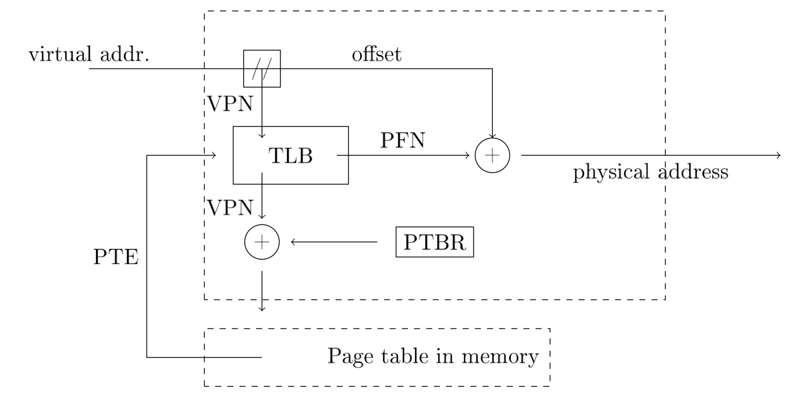

## Fork 

* After creating a new process using `fork()` the two porcesses will share open files but **not** the stack, the heap, globla memory, and code area

* The two process will share the file current position and combine the write operations. (exo 1.3 from second exam of 2018)

* code `fork` example

```C
int main () {
	if (pid == 0) {
		// child
		return 0;
	} else {
		//mother 	
	}
	wait(NULL);
	//executed when the child has terminated
	return 0;
}
```

## Stack

* On the stack : 
	* ESP = current stack pointer
	* EBP = base pointer for the current stack frame
	* under the base stack pointer : previous EBP, return IP, lacation for returned element, arguments. 


## Pipes 

* When you read from or write to a pipe you will use the regular library procedures that are used for files

* Pipes have built in flow control. If the consumer does not read from the pipe the producer will be suspended when tries to write the filled pipe. 

## Scheduling 

* State diagram for scheduling processes :


* $T_{turnaround} = T_{completion} - T_{arrival}$

* First come First Serve

* Shortest job first

* Shortest time to completion first

* $T_{response} = T_{first scheduled} - T_{arrival}$

* Round robin : give a time slice for each task

## Sockets 

* SOCK DGRAM : A one way, medium oriented, unreliable disorderd socket

* SOCK STREAM : A bi-directional, change-oriented, reliable, orderly channel with flow control

* SOCK SEQPACKET : A bi-directional, message oriented reliable, orderly channel with flow control

* The big difference is that SOCK STREAM is a double direction connection providing a sequence of bytes while SOCK DGRAM is a one directional channel for messages of limited size. 

* The advantages SOCK DGRAM is that the receiver will receive one message at the time and need not to think about how to divide a sequence of bytes into messages. 
If the messages are of limited size it is almost always better to use SOCK DGRAM.
The order is however not guaranteed not that messges actually arrive. 
If this is important one has to implement a protocol to keep the order and request resending.

## File System

* We represent files using an inode with pointers to data blocks with the contents of the files.
The inode also contains metedata for the file but can be reprensented with e.g 256 bytes.
The first segment contains information about the file system. 
The second and third segment have bitmaps that discribe whihc inodes and data blocks are free.


* The content of a directory gives us : name, type, and inode number
The type can be file, folder, soft link etc.
for all properties fo a file (size, created, changed, owner etc) of a file we must retrieve the file's inode.

* Each inode contains information about how many hard lonks there are to file. When we delete the last link, the file will be deleted (its data will remain on the disk but its not accessible via the file system).

* Log file system : An inode map is always written last in a write ans is a mapping from inode ID to the block for the respective inodes.
A structuure CR (Checking point region) is in a fixed posotion and holdes a pointer to the last written inode map.


## Other

* Don't forget to free the memory after allocating on the heap. 

* Question 1.6 for the first 2018 exam.   
If we just do `sched_yield()` the operating system will pick us up again for execution, regardless of whethe the lock is free or not. 
If we instead use `futex_wait()` then we will be suspended until a process wakes up (which is done by the process that realease the lock).
When we wake up we must try to take the lock again

* Language as Java us automatic memomry managment. The systems allocate structure on the heap which, when it starts to get full, collect garbage.
The garbage collection identifies structures that are no longer needed and reuses that space in the continued execution.

* A Zombie process is a process that is terminated but where the parent process has not yet retrieved the result.
When / if the parent process picks up the result through a call to `wait()`, the process can be removed from the system.
If the parent process has terminated, the process is inherited by init which will pick up its results.

* memory mapping of a running process : 
	* The first three segments are code, read only data and global data
	* Then there is a segment for the heap
	* The segment maked with `lib-2.23.so` is a shared library/ 
	* In the uppermost region we find the segment of the stack (startign by 7ffd6...) 
Cf exo 1.2 from second exam of 2018 

* The problem is that we release the lock and then suspend on the conditional variable on two operations. 
If the porcess is interrupted between these operations, another process might : call `get()`, take the lock, remove the item from the buffer and signal.
If we don't suspend on the conditional we will never wake up.
Cf question 2.1 from first exam 2019

* The clock algorithm approximates LRU (least recently used). 
It only notes that a page has been used since the last turn, not how often or when it was accessed. 
If it is time to swap a page and alla pages are marked as being used, the algorithm will clear the markers one by one and the swap the first page. 
It could be thaht this page was the page taht was access most recently and thus should not be swapped.

* A paging MMU with TLB 



* Differents types : 


