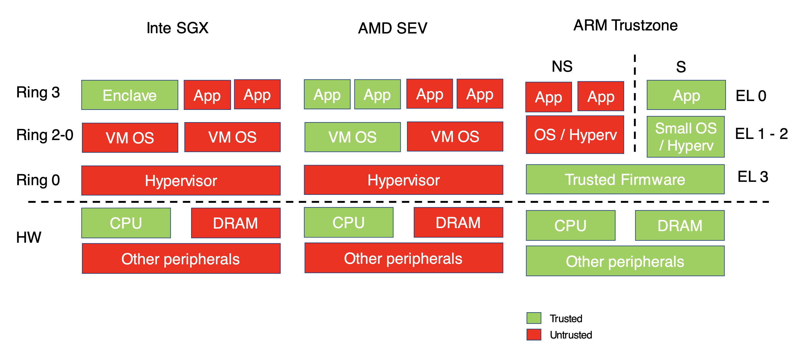

---

**Markdown** version on
[*github*](https://github.com/caillouc/Fiche_EPFL/blob/main/System_Security/System_Security.md?plain=1)  
Compiled using [*pandoc*](https://pandoc.org/) and [*`gpdf` script*](https://github.com/caillouc/dotfile/blob/linux/gpdf.sh)  

# Side Channels & Tempest

* **Compromising Emanations**: Physical signals related to digital activity;
  break the assumption of higher-level abstractions; Root cause of many attacks
* **Tempest**: Passive leakage of plaintext information (E.g., video on screen)
  * Video Signal
    * Signal in wire/connector/etc. not well shielded
    * Current in wires generates EM waves
    * Modulated with the pixel values
* **Soft Tempest**: Active version of *Tempest*; leakage used to exfiltrate data
  * Vide Signal
    * Signal in wire/connector/etc. not well shielded
    * Current in wires generates EM waves
    * Modulated witht the pixel values
    * Use to transmit data
    * Or to add noise Tempest leakage
    * Possible with many other sources of leakage (e.g. memory access)
* **Side Channels**: Use leakage to attack cryptographic implementation (Only in
  proximity, with few exceptions)
* Type of *pysical leakage*: Execution time, Power, Magnetic and
  electromagnetic, optical, thermal, acoustic and vibrational, reflection of
  injected signals
* Type of *attack*: Passively recover plaintext, Actively exfiltrate data;
  attack cyrptographic implementation
* **Symmetric encryption** for *confidentiality*
  * *Stream cypher*
    * Process a message bit by bit (byte by byte)
    * $KeyStream = PseudoRandomBitStreamGenerator(seed)$
    * $CyphertextStream = KeyStream + PlaintextStream$
  * *Block cypher*
    * Process a message block by block (EAS, DES)
    * Plaintext might need *padding*
    * $Plaintext + Key = BlockCipher$
    * All block cipher leads to the cipher text
    * There is different way to concatenate block cipher
    * **Electronic CodeBlock** (ECB, *insecure*) $C_1 = P_1 \bigoplus K$, $C_2 = P_2 \bigoplus K$, ...
    * **Cipher Block Chaining** (CBC) $C_1 = (P_1 \bigoplus IV) \bigoplus K$,
      $C_2 = (P_2 \bigoplus C_1) \bigoplus K$, ...
* **Symmetric crypto for authentication**
  * **Message Authentication Code (MAC)**
  * Shared key between $A$ and $B$
  * $A$ sends to $B$ message $M + MAC$ where $MAC = MACFunction(M, K)$
* **Asymmetric crypto for confidentiality**
  * $A$ and $B$ exchange a key pair via a trusted channel
  * $A$ wants to send $M$ to $B$, she sends: $C = Encryption(Pu_B, M)$ where
    $Pu_B$ is $B$'s public key
  * $B$ decrypts the message as follow: $M' = Decryption(Pr_B, C)$ where $Pr_B$
    is $B$'s private key
* **Asymmetric crypto for authentication**
  * $A$ send to $B$ message $M$ and Signature $S$, where $S = Encryption(Pr_A, M)$
    where ($A$'s private key)
  * $B$ verifies the signature by checking: $Decryption(Pu_A, S) = M$ where
    ($Pu_A$ is $A$'s public key)
* Combine the best of two: Asymmetric key exchange + Symmetric encryption
* **Security** of cryptographic algoritms
  * We *model* system and possible attackers
  * Security properties are valid under certain *assumptions*
* Side Channel concrete example
  * **Timing**: Measure execution time
    * Classic timign attack against RSA
    * Remote attack are possible
    * Modern example of remote attack onc cryptocurrencies
  * **Power** Measure some physical quantity influenced by execution
    * Simple Power Analysis (SPA)
    * Differential Power Analysis (DPA)
    * Correlation Power Analysis (CPA)
* Reminder on **RSA**
  * *Key generation*
    1. Chose numbers $p$, $q$ such that $p$ and $q$ are prime and $p \neq q$
    2. Compute $n = pq$
    3. Compute $\Phi(n) = (p-1)(q-1)$
    4. Chose $e$ such that $e$ and $\Phi(n)$ are relative prime and $1 < e < \Phi(n)$
    5. Compute $d$ as such that $de \mod \Phi(n) = 1$
    6. Public key $PU = \{e, n\}$
    7. Private key $PR = \{d, n\}$
  * *Encryption*
    * Plaintext $m < n$
    * Ciphertext $C = m^e \mod n$
  * *Decryption*
    * Ciphertext $C$
    * Plaintext $m = C^d \mod n$
  * *Signature*
    * Plaintext $m < n$
    * Signature $s = m^d \mod n$
  * The *security* of RSA is based on two hard problems
    * The RSA problem, i.e., computing the $e^{th}$ root of $m$ modulo $n$ from
      $C = m^e \mod n$
    * FActoring large numbers into smaller primes
* Exponentiation is implemented using *Square and multiply*
  * Problem 1
    * Key dependant branching
    * Execution time depends on the key $d$, if bit $i$ of $d$ is $0$ is will be
      faster than if bit $i$ of $d$ is $1$
  * Problem 2
    * Montgomery used for modular multiplication because it is more efficient
    * Montgomery execution time $T_{mont}$ depends on the plaintext $m$; there
      is a reduction step done only if necessary
* **Countermeasures**
* **Constant time**
  * Relatively easy for specific cases
    * E.g., modular multiplication without conditional reduction
  * Generic protection is hard
    * Identify and elininate all dependencies of time with plaintext and key
    * Can have performance issues
* **What if we artificially add noise**
  * An attacker jus tneed more measurements to dig the signal out of the noise
* **Masking**: Can we make it impossible fot the attacker to guess
  * Mask with random number C different for each message:
    * $md \mod n \rightarrow [(m.X)d \mod n] . [(X^{-1})d \mod n] \mod n$
  * Intuitively, given $m$ and $d_i$ the attacker cannot guess slow/fast any
    more
* A **logic gate**
  * Electronic component that implements a logic operator (not, and, nand, or,
    xor)
  * Stateless (Combinatorial)
  * Together with memory elements it is used to implement finit state machines
* *MOS transistor*: electronic switch
* Logical gate can be implemented with MOS
* **Data dependency**: There are physical phenomena that create a data
  dependency between logic values and their transitions and the power
  consumption of the circuit
* **Measure**
  * We can measure the power consumption and observe these phenomena
  * Signals are small, many measurements and statistical analysis are often
    needed
* **Model**: we know how it works: given some logic data manipulated by the
  software/hardware, we can predict the corresponding power consumption
* **Countermeasures**
  * *Problem*: There is a data dependency (of some order) between plaintext,key
    and the power
  * Add noise
    * Desyncronize ther traces
    * Inject random noise
    * Defeated with better signal processing and more measurements
  * Try to balance the hardware
    * Filtering shielding (Filtering is not perfect, expensive, can be tempered)
    * Make a processor where every instruction/operands consumes the same power
      (Not easy and expensive)
  * $N^{th}$ order masking
    * Multiply each data with a random variable
    * This algorithmically breaks the dependecy making it impossible to guess
      the intermediate value
* **EM side channel**
  * Currents flowing in cables produce EM signals
  * Clock might act as a carrier
  * Emissions from localized areas, are not all overall power consumption
* **Sound side channel**
  * Currents in certain capacitors make them vibrate and produce sounds
* We don't always need a physical access
* **Tamper resistant** systems take the bank vault approach
  * Prevention of break in
* **Tamper responding** systems use the burglar alarm approach
  * Real-time detection of intrusion and prevention of access to sensitive data
* **Tamper evident** system are designed to ensure that is a break-in occurs,
  evidence of the break in is left behind
  * Detection of intrusion
      
# Architectural Support for Security

* **Application security**: Requirements
  * **Launch-time integrity**: correct application was started or loaded
  * **Run-time isolation**: no interference from malicious software, peripherals
  * **Secure persistent storage**
* **OS Security**: Privilege rings
  * Ring 3: applications
  * Ring 2: Device drivers
  * Ring 1: Device drivers
  * Ring 0: Kernel
  * Currently, only *ring 0* and *ring 3* are used
  * CPU tracks the current privilege level CPL using two register bits
  * Main uses: limiting access to privileged instructions, I/O-ports
  * Legacy use: kernel memory protection
  * Privilege in Modern OS (only two levels)
    * Level 0 for the kernel
    * Level 3 for users
* Calls across Privilege Rings
  1. Before **syscall**, put argument into registers
  2. Issue **syscall** $\rightarrow$ CPU changes privilege level and calls
     *Hook*
  3. *Hook* performs access policy checks and validates arguments
  4. Kernel performs the requests action
  5. Return to the application
* **Discretionary Access Control** (Linux Security Model)
  * A means of restricting access to objects based on the identity of subjects
    and/or groups to which they belong. The controls are discretionary in the
    sense that a subject with a certain access permission is capable of passing
    that permission to any other subject
* **Users and Groups**
  * A *user-account* (user, uid)
    * Represents someone capable of using files
    * Associated both with human and processes
  * A *group-account* (group, gid)
    * Is a list of user-accounts
    * Users have a main group
    * May also belong to other groups
* **Permissions**
  * A file has owner and group id
  * A process has owner and group id
  * Kernel verifies permissions before executing system calls
    * If owner uid = 0(root), everything in allowed
    * Otherwise the uid and gid of the process and object are compared in this
      order and permission for the operation is searched based on owner, group,
      and other rights
* A **basic transaction**, wherein a *subject* (user or process) attemps some
  action (read, write, execute) against some *object* (file, directory, special
  file)
* `setuid` bit means program run with same privileges as owner
  * No matter who executes it
* `setgid` bit means run with same privileges as a member of the group which
  owns it
  * Again regardless of who executes it
* Password are changed using the program `/bin/passwd`
* Real UID (RUID): UID of the user running the program
* Effective UID (EUID): UID of uer with whose privileges the program runs
* `getuid()` returns RUID
* `geteuid()` returns EUID
* `setuid(uid)` set UID
  * If EUID == root, set EUID and RUID
  * If not root, sets EUID if certain conditions are met
* `setruid(uid)` set RUID
* `seteuid(uid)` set EUID
* `fork()` functions shall create a new process. The new process (child process)
  shall be an extact copy of the calling process (parent process)
* Linux uses a DAC security model but **Mandatory Access Control (MAC)** imposes
  a global security policy on all users
  * User may not set controls weaker than policy
  * Normal admin done with accounts without authority to change the global
    security policy
  * but MAC systems have been hard to manage
* **SE linux**
  * In SELinux, all access must be explicitely granted
  * Allows no acces by default, regardless of the linux user/groups ids
  * There is no default superuser in SELinux unlike the `root` in standard linux
  * Each individual subject and object in SELinux is governed by a **security
    context** being a:
    * User - individual user (human or daemon)
    * Role - like a group, assumed by user
    * Domain (type) - a sandbox being a combination of subjects and objects that
      may interact with each other
    * this model is called **Type enforcement (TE)**
  * Decision making
    * **Access** decisions: when subject do things to objects that already
      exist, create new things in expected domain
    * **Transition** decisions: invocation of processes in different domains
      than the one in which the subject process is running; creation of objects
      in defferent types (domains) than their parents domain; transitions must
      be authorized by SELinux policy
  * Access in granted by specifying access from a subject type (that is, a
    damain) and an object type using an allow rule
  * A domain transition is allowed only when the following three conditions are
    tue
    * The process' new domain type has *entrypoint* access to executable file
      type
    * The process' current domain type has *execute* access to the entry point
      file type
    * The process' current domain type has *transition* access to the new domain
      type
* **Paging-based Security**
  * Security-relevant data in page table entries
  * *Supervisor bit*: if set, this page is accessible only in ring 0 (isolates
    OS from applications)
  * *RW bits*: to distinguish between read-only and writeable pages
  * *Non executable (NX) bit*: if set, the page is not executable (prevents
    run-time code injection)
* **Virtual address space**
  * Every process has its own virtual address space
  * Kernel address space is protected with the supervisor bit
* **Firewire DMA**
  * Key idea: Access RAM is tightly controlled by the CPU, but this can be
    circumvented through **DMA** (Direct Memory Access)
  * Firewire technology allow for fast communication speeds between devices, use
    DMA
  * The attacker uses a Firewire cable to connect to a (locked) PC and issue a
    DMA request to fetch the contents of RAM
  * Later on, can look in the collected data and leak keys and other passwords
* **BadUSB**
  * Key idea: change a USB device controller to mimic another device class
* **DMA remapping**
  * Setup by the OS, similar to MMU
  * Control DMA access to physical memory
* *OS trust assumptions*
  * Intel Managment Engine
  * BIOS/UEFI
  * Periferical firmware
  * etc.
* **Physical access Attacks** are harder to defend for the OS
  * Remove the hard drive from a machine left unattended
  * Boot from a USB key and copy the data out/change the password
  * Trivial (and possibly broken) solutions:
    * Prevent booting from an external source from the BIOS (Broken; we can
      reset the bios by removing the battery)
    * Protect the BIOS with a password (Broken; we can reset the bios by
      removing the battery)
    * Partial/Full disk encryption
    * Data hiding
* **Disk encryption**
  * *Simple approach*: use password only
    * The disk is encrypted with a key that is protected using a user-privided
      password
    * Problem: password can be brute-forced
  * *Better approach*: leverage a secure element
    * The disk key encryption is stored in a secure element
    * Example: Trusted Platform Module (TPM) chip on motherboard
* **Cold Boot Attack Process**
  * *Normal operation*
    * The user logs with a password
    * The disk encryption key is kept in RAM when the computer is locked
  * *Attack process*
    * Attacker opens the machine to expose the RAM chips
    * Remove power
    * Cool down RAM (dust-sprayer upside down (-50 degree), LN2 (-192 degree))
    * Plug RAM module to another (acquisition) platform
    * Recover key
* Cold Boot Attack: *Countermeasures*
  * Erase key from memory on every (controlled) suspend
    * User needs to type in password often
    * Does not help sudden power loss
  * Prevent booting from external media
    * Does not prevent DRAM component transfers
  * Physical protection
    * Components that respond to enclosure opening or low temperatures
    * Expensive for commodity systems
  * Avoid placing the key in memory
    * Performs encryption in disk controller
    * Requires architectural changes
* **TPM Support**
  * **Secure boot**: OS boots only if the chain of trust is valid
  * **Authenticated boot**: System records chain of trust but the OS boots even
    if the chain of trust in invalid
* **UEFI** instead of BIOS
* Hardware-supported OS-based - Application Security

| . | Hardware support for OS-based Security |
| --- | --- |
| CPU | Privilege rings
| | Memory Management Unit |
| Chipset | DMA Remapping tables |
| Periferals | Trusted Platform Module |
|  | Normal HDD with OS-enforced access control |

* Runtime Attacks: Typical Attacks
  * Buffer overflows
  * Format string
  * Double free
  * Use-after-free
* Runtime Attacks: Mitigation Techniques
  * **Non-executable pages (NX)**
    * Attackers used to place shell code in normal data pages/stack
    * Stack should not be executable
    * Mark all pages that do not contain code as Non-executable (NX)
    * Hardware support required
    * Mark all pages with executable code as read-only
    * Not always possible
  * **Stack canaries**
    * Add random stack canaries
    * To overwrite the return pointer, the stack canary must also be overwritten
    * Check the value before jumping to return address
    * Can prevent some attacks
    * Assumes the attacker cannot read memory
  * **Address space layout randomization (ASLR)**
    * Return to libc: overwrite return pointer with address of `exec(/bin/sh)`
    * What if we move the binary by a few MB in its virtual address space?
    * The location of `exec` will be unknown to the attacker
    * Implemented in all major operating systems
    * KASLR (linux) also defends against Meltdown
    * Broken if the attacker can read memory (separate info leak exploit)
  * **Control flow integrity**
    * Generate all legal control flow transfers
    * Verify every transfer at runtime
    * Straight forward for direct-control transfers
    * Static destination addresses
    * Forward edges: switch statements, indirect calls, etc.
    * Backward edges: returns

# Trusted Execution Environment

* **Defense in depth**:
  * Small Trusted Computing Base (TCB)
  * Even if the OS/Hypervisor are comprised, code/data can be protected
* **Confidential computing**:
  * Client can verify what is running on remote system; operator cannot violate
    the integrity of the execution
  * Operator cannot see the code/data of the client
* Enforced in Hardware (typically via special CPU instructions or co-processor)
* We need to trust the HW manufacturers: Intel, AMD
* Vulnerable to some side channel attack
* **Computing Systems Trust Model**
  * The **Trusting Computing Base** (TCB) is the set of software and hardware
    components that need to be trusted for an application to execute securely
  * For instance, the TCB of a banking application includes the Operating
    System, the CPU, the DRAM chips, the disk ...
    * If any of these are malicious the execution integrity and confidentiality
      cannot be guaranteed
  * Other applications are not in the TCB
  * In principle, they can be malicious and the OS (with hardware support) still
    provides isolation to other benign apps
    * However some exploit can lead to privilege escalation
  * **Trusted Execution Environment (TTEs)** usuallly aim to reduce the TCB
    needed to execute applications
* *Primitives*: Isolation, Bootstrapping trust, Sealing storage
* **Isolation** (defense in depth and confidential computing)
  * CPUs traditionally enforce isolation berween permission levels
  * More privileged levels control and can modify less privileged levels
* **Intel SGX** *Isolate 'small' Apps into enclaves*
  * Design choice
    * Create isolated environments at the application level, called **enclaves**
    * Enclaves are isolated from all the other software in the system
      OS/Hypervisor
  * Resists a physical attacker (cold boot attack, bus tapping, etc)
    * Everything outside the CPU die is untrusted
    * The CPU die is assumed to be secure
  * The OS and the Hypervisor are still in charge of managing virtual memory and
    interrupts
  * The CPU keeps track of whether it is currently executing in enclave-mode and
    which enclave is executing
  * Memory reads to enclave memory when not in enclave mode always return `0xff`
  * Trying to read another enclave memory returns `0xff`
  * Similarly, not authorized memory writes fail silently
  * Enclaves can read/write the memory to their untrusted app
  * New component on the CPU takes care of securing memory, the **Memory
    Encryption Engine (MEE)**
  * The CPU is trusted, so data resides in the cache in plain text
  * While the content of memory pages is protected by SGX and the MEE, page
    metadata is not, metadata includes:
    * Access permissions of a page
    * Accessed bit: whether a memory page was recently accessed
    * Dirty bit: whether a memory page was recently written
  * **Controlled Channel attacks**
    * The os can remove execute or read/write access to memory page
    * This trigger an exception which contains the address of the memory page
      that was being accessed
    * This reveals enough information
    * Information from the accessed/dirty bits are also enough to leak
      information
  * **Side Channel attacks**
    * Enclaves share resources with other applications in the system: cache,
      core execution units, branch prediction structure
    * Monitoring utilization of these resources from another application leaks
      information
* **AMD SEV**: *Isolate entire VMS*
  * Design choices:
    * Isolate Virtual Machine from Hypervisor. VMs can execute code on ring 3,2
      and 1
  * Resists low skilled physical attacker (cold boot, but not bus tampering)
    * Everything outside the CPU die is untrusted
  * Comparison with SGX
    * SEV encrypts data that leaves the CPU die
    * However, it does not store a MAC tag together with the data (data in
      memory is not authenticated)
    * Like SGX, SEV keeps track of the different isolated environments with HW
      prinitives
    * While unauthorized writes cannot happen from the CPU, if memory is
      corrupted some other way VMs will read the wrong value from memory
  * Key management
    * SEV uses an ARM co-processor to manage the different encryption key for
      each VM
    * At VM creation a new key is created in the co-processor to encrypt the VM
      memory
    * Each new VM has a different encryption key
* **ARM TrustZone**: *The tale of two world*
  * Design choices:
    * Have two separate isolated execution environments. These are referred to
      as the Non secure and the Secure world
  * No physical attacker
    * Communication to peripherals is assumed to be trusted
  * The memory is partition between the Secure and Non-Secure world
  * The Secure world can read/write the Non-Secure world memory, but the
    Non-Secure world is restricted to its own memory
  * The TrustZone Address space is controller (TZASV) is a hardware component that is
    used to configure which ranges of memory belong to which world
  * Only the secure world can configure the TZASV
  * Memory is separated at the physical layer. That is there are two separate
    physical address ranges, one for the secure world and one for the non-secure
    world
  * The CPU keeps track of which world in currently executing
* **AMD SEV**
  * *Advantages*: 
    * Tolerate strong physical attacker, only CPU in TCB
  * *Disadvantages*: 
    * Memory and interrupt management performed by OS
    * Application need to be adapted to run inside an SGX enclave
    * Only small applications possible
* **AMD SEV**
  * *Advantages*: 
    * Applications do not need to specifically adapted to run in an isolated SEV
      environment
  * *Disadvantages*:
    * Resilience against physical attackers varies depending on the SEV version
    * Memory management perfromed by hypervisor
* **ARM TrustZone**:
  * *Advantages*:
    * No page/interrupt management by untrusted code, infrastruture (partially)
      supports secure state
    * Availability guarantees for sedure world possible
  * *Disadvantages*:
    * No physical attacker
    * Only one protected state
    * All software runnin before and under software in secure world need to be
      trusted
    * Secure state is often locked for use by device vendors and not generally
      open for application developpers
* **Trusted Isoltation Environments** Trust Model summary

* **Bootstrapping trust** (Attestation/Secure boot) (confidential computing)
  * The isolation provided by TEEs is a useful primitive
  * However secret need to get into the TEE somehow
  * How do we make sure that we are sending secret to the right TEE and not the
    malicious OS
  * The main way to prove the authenticity of a TEE:
    * **Secure boot** check that at each boot stage, only trusted software is
      loaded
    * **Remote attestation**
* **Remote Attestation**
  * Different Enclaves and keys involved
  * CPU measures the enclave and signs it hash
  * Enclave invokes measurement, OS is suspended, CPU measures and returns the
    the signed hash
  * This can be done so that client creates a secure channel into the enclave
* **Sealing storage** (defense in depth and confidential computing)
  * Enclave has no direct access to disk or IO / no access to persistent storage
  * No access to trusted clock, limited support for counters
  * Can do **sealing** - store encrypted confidential data on disk
    * This data is encrypted and MACed with enclave and processor specific keys
* **Remote Attestation**
  * During manufacturing, two keys are burned into the CPU
    * **Fused Seal key** is used as Processor's secret
    * **Provisionning key** serve as a proof for remote platform
    * Remote platform issues an **Attestation key** which is encrypted and
      stored for future use
* To prevent attestation key from leaking the platform's identity, Intel
  introduces the **EPID** scheme
  * **EPID**: digital signature scheme with anonymity properties
    * One group public key corresponds to multiple private keys
    * Each unique private key can be used to generate a signature
    * Signature can be verified using the group public key
    * A signature cannot be linked to a private key

# Memory vulnerabilities and Exploits

* **x86 Machine Model**
  * Both code and data are represented as numbers
  * **Little endian**: least significant bytes is put at lower addresses
  * **Stack** grows down, other memory accesses move up
* **OS Model**
  * Ring-0,runs on behalf of every process
  * Context switches
    * On an interrupt, CPU switches control to ring-0
    * Ring-0 (OS) sets CR3 to another process, then `iret`
* Stack organization:
  * Function parameters
  * Return address
  * Saved Frame Pointer
  * Function's data
* **Integer Overflow**
* **Use after free**
* **Double free**
* **Format string vulnerabilities**
* **Upcasting**: From a derived class to its parent class
* **Downcasting**: From a parent class to one of its derived classes
* Upcasting is always safe, but downcasting is not
* Hardware does *not give memory and type safety*
* **Control oriented Exploits**
  * Goals: Divert or Hijack Control Flow
  * Main tricks:
    * Corrupt code pointers
    * Corrupt non-code pointer
  * Outcome:
    * Code injection
    * Code reuse
* **Data oriented Exploits**
  * Goal: Hijack Data flow
  * Outcomes: Privilege escalation, Data leakage
* **Code injection**: A memory exploit that hijacks control to jump to
  attacker's data payload
  * *Requirements*
    * Write attack payload in memory
    * Have Attack Payload Be Executable
    * Divert control-flow to payload
* **Code pointers**: A memory address, the value of which is deirectly used as a
  control-flow transfer (in machine code) under benign inputs
  * **Code pointer injection**: Forging the runtime value of a code pointer to
    an invalid one
* **Type safety for Code Pointers**
  * Enforce that code pointers point to code-segment only
  * Enforce that control transfers use code pointers
  * Defeats code injection
* **Code reuse**: A memory exploit that hijack contro to jump to attacker's
  controlled code address
  * *Requirements*
    * Have attack payload be excutable
    * Divert control flow to payload
  * Type safety of code pointers in not enough
  * The idea:
    * Attacker hijacks control flow
    * Jumps back to the code segment
* **Control flow integrity**: Each control transfer jumps to a statically known
  set of locations
* **Data flow switching**
  * Manipulate data flows for exploits
  * Goal:
    * Information leakage
    * Privilege escalation
  * Constraints:
    * Keep the control flow same
    * Prevent abrupt termination
* **Defense goals**
  * Complete memory safety
  * Prevent memory writes
  * Protect all pointers
  * Protect code pointers
  * Prevent bad control flow transfers
  * Protect arbitrary parts/region of memory
  * Protect data-flow patterns
  * Complete Type safety
  * Don't protext, simple randomize
    
# Memory Defenses

* Complete **Memory Safety**: Access memory in an intended way
* **Fault isolation**: Each module only accesses pre-determined data/code
* **No foreign code**: Execute only predetermined code
* **Control flow integrity**: Control transfers are to legitimate points only
* **System call sandboxing**: Access only a subset of system calls
* **(Code) pointers/Data integrity**: Ensure (code) pointers/date have valid
  values
* **Data flow integrity**
* **Non-executable Data/DEP**
  * Setting regions of memory non-executable
  * Use NX bit
  * *Defense goal*: Prevents Foreign code injection
* **Software Fault Isolation**
  * *Goal*: Fault isolation
    * Confine read/write to certain region $M$
    * This goal is also called *address sandboxing* (Access memory segments
      statically verified)
  * Attacker controls all memory values in $M$
  * Mechanism: Inline instrumentation of $D$
  * Limit all memeory acces to region $M$
  * **Trusted Computing Base (TCB)**: The trusted codebase for ensuring security
    properties
  * Smaller the TCB, the better the design
* **Inline Reference Monitors**: Control flow integrity
  * Follow the statically determine CFG at runtime
  * CFI blocks all control flow hijacking exploits
* **Randomized tags**: Control flow integrity; Each code block must start with a
  tag
  * The tag should be a random, secure value
  * If `f` can jump to block `g`, `h`, ... then these blocks, should have the
    same tag
* **Address Space Layout Randomization (ASLR)**
  * *Assumption*: The attacker can write arbitrary places
  * *Defense goal*: Attacker can't predict location accessed in attack
  * *Mechanism*: 
    * At load time, randomize stack, code, bss, etc.
    * Randomize heap location at runtime
* **Instruction Set Randomization (ISR)**
  * *Goal*: Randomize machine instruction encoding, to defeat foreingn code
    injection
* **Stack Canaries** 
  * Secret Data values, to protect corruption of nearby data
  * Check: the random canary value is OK at ret
* **Guard Pages**
  * *Defense*: Guard Pages
    * Certain pages with NR, NW, NX inserted
  * *Assumption*: 
    * Attacker can only write linearly
    * All written values are not used in dereferences
* **Code Checking Tools**
  * Tools checking for vulnerabilities using static source code analysis
* **Safe Language and Coding**
  * Use bug-finding techniques
  * Safe code techniques
  * Use safe libraries

# Detection and Prevention

* **Information Flow Policies** Non interference
  * Differentiate programs with good information flows
  * Non interference: 'A program is non interfering iff any executions, started
    with the same L-Inputs, generate the same L-Outputs'
* **Bell-LaPadula**: No read up, no write down
* **Kinds of Information flow**
  * **Direct**: use legitimate channels for data transfer
  * **Indirect**: use channels not intended for data transfer
  * **Explicit**: created by the occurence of an event/action
  * **Implicit**: created by the absence of a specific event/action
* Application of **Taint-tracking**
  * A kind of Information Flow Technique 
  * Runtime Detection/Prevention
    * Controle flow hijacking
    * Non control data corruption
    * XSS, SQL, Command injection
    * User Kernel Pointer Bugs
  * Off line Analysis
    * Malware Analysis
    * Privacy-leaking Android apps
  * $f: X \rightarrow Y$
    * $X$ has some bits in which are private
  * Aims to detect: Does an output $Y$ reveal some private $X$
* **Soundness & Completeness**
  * *Goal*: Given $P$ prove that $P$ satisfies $C$
  * **Complete**: Identifies all safe $P$s
  * **Sound**: If $P$ is claimed safe, it does not satisfy $P$ (?)
* In practice choose 3 between **Sound**, **Complete** and **Termination**
* **Static tracking**
  * Relies on CFG/DFG
  * *Advantages*
    * No false negative
* **Dynamic tracking**
  * Dataflow at runtime
  * *Advantages*
    * Can have FPs
    * But lower FP
* **Uncertity and Entropy**
  * **Shanon Entropy**

$$ H(X \mid Y = y) = \sum_{x \in \mathcal{X}} P[X = x \mid Y = y] \log \frac{1}{P[X = x \mid Y = y]} $$ 

* Initial uncertity = Information leaked + Remaining uncertity 
  ($H[X] = I[X;Y] + H[X \mid Y]$)

* **Symbolic Execution**
  * Check Safety Properties (Model)
* **Dynamic Symbolic Execution**
  * *The main idea*: Analyze One Execution Path
    * Run the program under one concrete input
    * Collect the values of all variables at each executed statement. This
      information often called an 'execution trace'
    * Mark certain inputs as symbolic
    * Track the relationship between variables in the execution trace and
      symbolic inputs as a formula
    * At symbolic branch conditions, assert that the condition evaluates to the
      value in the execution trace
    * Calculate Symbolic Formula for path constraints: The logically comjunction
      of all the symbolic constraints
  * **Symbolic input**: Values captured with symbolic formula
  * **Branch constraints**: A symbolic formula capturing the values that make
    the branch condition evaluate a specific value
  * **Path constraints**: A formula over the symbolic inputs that encodes all
    branch decisions taken up to a certain program point
  * **Execution path space**: All paths in the program, each captured by its
    path constraints
  * **Feasible path** A path which has a satisfiable symbolic formula, there
    exists one assignement  of values to its symbolic variables that make
    formula 'True'
* Testing software for bugs
  * **Blackbox testing**: no analysis
  * **Greybox testing**: 
    * Lightweight analysis
    * Coverage
  * **Whitebox testing**:
    * Heavyweight analysis
    * Path conditions
* **Fuzzing**
  * Automatically generate test cases
  * Random
  * Grab & mutate
  * Grammar based
* **Greybox fuzzing**
  * Guide input generation toward a goal
    * Guidance bsaed on lightweight program analysis
  * Three main steps:
    * Randomly generate inputs
    * get feedback from previous executions
  * What code is covered? Mutate inputs that have covered new code
* **American Fuzzy Lop**
  * Simple yet effective fuzzing tool
  * Targets C/C++ programs
  * Inputs are, e.g., files read by the program
  * Widely used in industry, in particular, to find security-related bugs
* **Measuring Coverage**
  * Different coverage metrics
    * Line/statement/branch/path coverage
  * Here: Branch coverage
  * Branches between basic blocks
  * Rationale: Reaching a code location not enough to trigger a bug, but state
    also matters
  * Compromise between
    * Effort spent on measuring coverage
    * Guidance it provides to the fuzzer
* **Detecting new Behaviours**
  * Inputs that trigger a new edge in the CFG: Considered as new behaviour
  * Alternative: Consider new paths
    * More expensive to track
    * Path explosion problem
* **Evolving queue of inputs**
  * Maintain queue of inputs
    * Initially: Seed inputs provided by user
    * Once used, keep input if covers new edges
    * Add new inputs by mutating existing input
* **Mutation operators**
  * *Goal*: Create new inputs from existing inputs
  * Random transformation of bytes in an existing input
  * Bit flips with varying lengths and stepovers
  * Additions and substraction of small integers
  * Insertion of known interesting integers
* More tricks for fast fuzzing
  * Time and memory limits
    * Discard input when execution is too expensive
  * Prunning the queue
    * Periodically select subset of inputs that still cover every edge seen so
      far
  * Prioritize how many mutants to generate from an input in the queue
* In-application Isolation Techniques
  * Page table protection
  * Software bounds checks
* **Pointer authentication**: Ensure pointers in memory remain unchanged
  * General purpose hardware primitive approximation pointer integrity
  * Adds pointer authentication Code into unused bits of pointer
  * Keyed, tweakable MAC from pointer address and 64-bits modifier
  * PA keys protected by hardware, modifier decided where pointer created and
    used
  * *Prevent arbirtrary pointer injection*
    * Modifiers do not need to be confidential
    * Visible or inferable from the code section/binary
    * Keys are protected by hardware and set by kernel
    * Attacker cannot generate PACs
